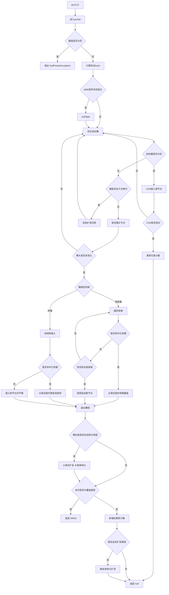

# JDK 常见线程安全集合源码总结（基于 OpenJDK）

> 主要依据 OpenJDK `java.util` 与 `java.util.concurrent` 源码。  
> 重点关注：线程安全策略、底层结构、扩容/缩容机制。

---

## 1. 总览分类

| 类别 | 代表类 | 底层结构 | 线程安全策略 | 扩/缩容特征 |
|---|---|---|---|---|
| 早期同步容器 | `Vector` | 数组 | 方法级 `synchronized` | 动态扩容；仅显式 `trimToSize()` 缩容 |
| 早期同步容器 | `Hashtable` | 数组+链表桶 | 方法级 `synchronized` | 动态扩容 `rehash()`；无自动缩容 |
| 同步包装器 | `Collections.synchronizedX` | 委托到底层集合 | 包装器上统一 `mutex` 同步 | 是否扩容取决于被包装对象 |
| 高并发哈希表 | `ConcurrentHashMap` | 数组桶 + 链表/红黑树 | 读基本无锁，写 CAS + bin 锁 | 动态扩容为 2 倍；无缩容 |
| 写时复制 | `CopyOnWriteArrayList` | 数组 | 写时加锁并整体复制 | 每次写都新建数组；删除相当于“复制成更小数组” |
| 写时复制 | `CopyOnWriteArraySet` | 基于 `CopyOnWriteArrayList` | 同上 | 同上 |
| 无锁链表队列 | `ConcurrentLinkedQueue` | 链表 | CAS 无锁 | 无界，按节点增长；无缩容 |
| 阻塞链表队列 | `LinkedBlockingQueue` | 链表 | `putLock`/`takeLock` 双锁 | 可选有界；按节点增长；无缩容 |
| 阻塞数组队列 | `ArrayBlockingQueue` | 循环数组 | 单锁 + 两个条件队列 | 固定容量，不扩不缩 |
| 阻塞优先队列 | `PriorityBlockingQueue` | 二叉堆数组 | 单锁 + 扩容时辅助自旋 | 动态扩容；无缩容 |
| 延迟队列 | `DelayQueue` | 底层 `PriorityQueue` | 单锁 + leader/follower | 无界；底层堆动态扩容；无缩容 |
| 传输队列 | `LinkedTransferQueue` | 无锁链表/双队列 | CAS + 匹配节点 | 无界，按节点增长；无缩容 |
| 并发有序 Map | `ConcurrentSkipListMap` | 跳表 | CAS + 无锁风格遍历/更新 | 节点按需增长；删除时会尝试降低顶层高度 |
| 并发有序 Set | `ConcurrentSkipListSet` | 基于 `ConcurrentSkipListMap` | 同上 | 同上 |

---

## 2. 各集合源码级结论

## 2.1 Vector

### 线程安全策略
- 典型老式同步容器，几乎所有公开方法都是 `synchronized`。

### 底层结构
- `Object[] elementData`
- `int elementCount`
- `int capacityIncrement`

### 扩容机制
源码中 `grow(int minCapacity)`：
- 若 `capacityIncrement > 0`，优先按固定增量增长
- 否则按“旧容量翻倍”增长
- 如果仍小于 `minCapacity`，至少扩到 `minCapacity`

结论：
- `Vector` 不是固定 1.5 倍规则，而是：
  - 有 `capacityIncrement`：按增量扩
  - 否则：近似翻倍

### 缩容机制
- **不会自动缩容**
- 只有显式调用 `trimToSize()` 才把底层数组裁到 `elementCount`
- `remove/removeAllElements/clear` 只是把元素置空，不回收数组容量

---

## 2.2 Hashtable

### 线程安全策略
- 公开核心操作基本都是 `synchronized`

### 底层结构
- `Entry<?,?>[] table`
- 桶内冲突用链表

### 扩容机制
源码 `rehash()`：
- 新容量 = `(oldCapacity << 1) + 1`
- 然后重分布所有桶
- 扩容触发条件：`count >= threshold`
- `threshold = capacity * loadFactor`

结论：
- `Hashtable` 扩容规则是 **2 倍再加 1**
- 不是 2 的幂

### 缩容机制
- **无自动缩容**
- `remove/clear` 仅删除元素，不缩小 `table`

---

## 2.3 Collections.synchronizedX 包装器

代表：
- `synchronizedCollection`
- `synchronizedList`
- `synchronizedSet`
- `synchronizedMap`
- `synchronizedSortedMap`
- `synchronizedNavigableMap` 等

### 线程安全策略
- 不是自己实现新数据结构
- 而是包装原集合，并在统一 `mutex` 上 `synchronized`

### 扩容机制
- **完全取决于被包装的底层集合**
- 例如：
  - 包装 `ArrayList`：按 `ArrayList` 扩容
  - 包装 `HashMap`：按 `HashMap` 扩容
  - 包装 `LinkedList`：无数组扩容

### 缩容机制
- **也完全取决于底层集合**
- 包装器本身没有额外扩缩容策略

### 关键结论
- `Collections.synchronizedX` 只是“加锁外壳”，不是新的存储实现

---

## 2.4 ConcurrentHashMap

### 线程安全策略
- 读取通常无锁
- 更新使用：
  - CAS
  - 桶首节点同步（bin lock）
  - 扩容时多线程协助迁移

### 底层结构
- `Node<K,V>[] table`
- 桶冲突为链表
- 冲突严重时树化为 `TreeBin` / `TreeNode`

### 扩容机制
源码特征：
- table 长度保持 **2 的幂**
- 负载阈值接近 `n - (n >>> 2)`，即约 `0.75 * n`
- 扩容时创建 `nextTable`
- 多线程可共同参与 `transfer`
- 扩容后容量通常 **翻倍**

### 特别点
- 当桶过长时：
  - 若表长 < `MIN_TREEIFY_CAPACITY(64)`，优先扩容
  - 否则树化
- 即：先尽量通过扩容降低冲突，再考虑树化

### 缩容机制
- **无自动缩容**
- 删除元素不会把 table 缩小
- 但树桶在某些拆分场景下可 `untreeify` 回链表，这是**桶结构退化**，不是 table 缩容

### put 过程源码级拆解

以下分析基于 OpenJDK `java.util.concurrent.ConcurrentHashMap` 当前源码主线，入口是：

- `public V put(K key, V value)`
- 内部直接调用：`putVal(key, value, false)`

其中第三个参数 `onlyIfAbsent=false`，表示：
- 如果 key 已存在，允许覆盖旧值
- 若是 `putIfAbsent`，则会走 `putVal(key, value, true)`

#### 1）入口：`put(K key, V value)`

核心逻辑非常短：

```java
public V put(K key, V value) {
    return putVal(key, value, false);
}
```

真正复杂度都在 `putVal`。

#### 2）第一步：空值校验 + hash 扰动（spread）

`putVal` 开头先做两件事：

1. `key == null || value == null` 直接抛 `NullPointerException`
2. 计算桶定位用 hash：`int hash = spread(key.hashCode())`

`spread` 的核心形式：

```java
(h ^ (h >>> 16)) & HASH_BITS
```

目的：
- 让高位信息混入低位
- 因为桶下标计算 `(n - 1) & hash` 主要依赖低位
- 降低低位分布差带来的热点碰撞

#### 3）主循环：`for (;;)` 自旋重试

`putVal` 主体是一个无限循环，不是逻辑失控，而是为了处理并发下的可重试场景：

- 表尚未初始化
- 遇到扩容迁移中的桶
- CAS 失败
- 加锁后发现桶头已经变化

整体策略是：**观察状态 -> 尝试修改 -> 失败则重试**。

#### 4）分支一：表还没初始化 -> `initTable()`

如果 `table == null` 或长度为 0，则调用：

```java
tab = initTable();
```

`initTable()` 的职责：
- 懒初始化 `Node<K,V>[] table`
- 使用 `sizeCtl` 控制初始化状态
- 通过 CAS 抢“初始化权”
- 只有一个线程真正分配数组
- 其他线程看到 `sizeCtl < 0` 时会自旋等待

初始化完成后：
- `table` 指向新数组
- `sizeCtl` 变成下一次扩容阈值（大约 `0.75 * n`）

#### 5）分支二：目标桶为空 -> CAS 直接插入

先计算桶下标：

```java
i = (n - 1) & hash
```

若目标桶为空：

```java
if ((f = tabAt(tab, i)) == null) {
    if (casTabAt(tab, i, null, new Node<>(hash, key, value)))
        break;
}
```

这是 `put` 的最快路径：
- 不加锁
- 直接 CAS 把 `null` 改成新节点

为什么成立：
- 空桶只需要一次原子占位
- 只有一个线程能成功
- 失败线程重试即可

#### 6）分支三：桶头是 `MOVED` -> 说明正在扩容，先协助迁移

如果桶头节点 `f.hash == MOVED`：

```java
else if ((fh = f.hash) == MOVED)
    tab = helpTransfer(tab, f);
```

含义：
- 当前桶已经被 `ForwardingNode` 占据
- 该桶数据已迁移或正在迁移到 `nextTable`

此时不能继续往旧桶写入，否则会破坏迁移一致性。正确做法是：
- 调用 `helpTransfer` 协助迁移
- 获取新的 table 引用
- 然后重新进入主循环

这也是 `ConcurrentHashMap` 扩容期间吞吐还能维持的关键：**发现扩容的线程不只是等待，而是参与扩容**。

#### 7）分支四：普通非空桶 -> `synchronized(f)` 桶级锁路径

如果目标桶非空且不是 `MOVED`，进入慢路径：

```java
else {
    V oldVal = null;
    synchronized (f) {
        if (tabAt(tab, i) == f) {
            ...
        }
    }
}
```

注意：
- 锁的不是整张表
- 也不是独立 lock 数组
- 而是当前桶头节点 `f`

这样做的原因是节省额外锁对象空间。

进入 `synchronized(f)` 后，还要再次检查：

```java
tabAt(tab, i) == f
```

因为在加锁之前，桶头可能已经：
- 被别的线程替换
- 被迁移成 `ForwardingNode`
- 被树化/删除

如果桶头已变，当前分支失效，只能重试。

#### 8）桶内分支 A：链表桶路径

若 `fh >= 0`，说明桶头是普通 `Node`，即链表桶：

```java
if (fh >= 0) {
    binCount = 1;
    for (Node<K,V> e = f;; ++binCount) {
        K ek;
        if (e.hash == hash &&
            ((ek = e.key) == key || (ek != null && key.equals(ek)))) {
            oldVal = e.val;
            if (!onlyIfAbsent)
                e.val = value;
            break;
        }
        Node<K,V> pred = e;
        if ((e = e.next) == null) {
            pred.next = new Node<>(hash, key, value);
            break;
        }
    }
}
```

这里做两件事：

1. **查找是否已有相同 key**
   - 通过 `hash` + `== / equals` 判断
   - 命中则记录 `oldVal`
   - 如果不是 `onlyIfAbsent`，覆盖 `e.val = value`

2. **若不存在则尾插新节点**
   - 遍历到链表尾部后 `pred.next = new Node(...)`

源码采用尾插很关键：
- 新节点总是追加在末尾
- 桶头在未删除/未迁移前保持稳定
- 这样“锁桶头 + 验证桶头未变”的策略才可靠

#### 9）桶内分支 B：树桶路径 `TreeBin`

如果桶头是树结构包装节点：

```java
else if (f instanceof TreeBin) {
    binCount = 2;
    oldVal = ((TreeBin<K,V>)f).putTreeVal(hash, key, value);
}
```

要点：
- 桶头不是 `TreeNode`，而是 `TreeBin`
- `TreeBin` 内部维护红黑树根、链表遍历入口以及树读写协调状态

`putTreeVal` 的职责：
- 查找是否已有相同 key
- 有则返回旧节点供更新
- 无则插入新的 `TreeNode`
- 必要时做红黑树平衡调整

#### 10）`binCount` 的意义：不只是计数，还决定树化/扩容检查

退出桶锁后会看：

```java
if (binCount != 0) {
    if (binCount >= TREEIFY_THRESHOLD)
        treeifyBin(tab, i);
    if (oldVal != null)
        return oldVal;
    break;
}
```

它有两个关键用途：

1. **判定是否需要树化**
   - 当链表长度达到 `TREEIFY_THRESHOLD`（8）时触发 `treeifyBin`

2. **区分“覆盖旧值”和“新增节点”**
   - 如果 `oldVal != null`，说明这次是更新，不再增加总元素个数

#### 11）`treeifyBin(tab, i)`：不一定真的树化

即使 `binCount >= TREEIFY_THRESHOLD`，也不是无条件转红黑树。

关键常量：
- `TREEIFY_THRESHOLD = 8`
- `MIN_TREEIFY_CAPACITY = 64`

如果表长 `< 64`：
- **优先扩容**
- 不立即树化

原因：
- 桶过长可能只是表太小
- 扩容后元素会重新分散到更多桶里
- 常常比维护红黑树更划算

所以这条逻辑的真实语义是：
- 桶太长了
- 如果表已经够大，再树化
- 如果表还小，先扩容试试看能否自然打散冲突

#### 12）插入完成后：`addCount(1L, binCount)`

如果本次是新增节点，而不是覆盖旧值，则退出主循环后调用：

```java
addCount(1L, binCount);
```

两个参数的含义：
- `1L`：总元素数增加 1
- `binCount`：当前桶的长度/形态提示，用于决定是否顺便做扩容检查

`addCount` 的职责：

1. 更新总元素计数
   - 优先 CAS 更新 `baseCount`
   - 竞争激烈时退化到 `CounterCell[]` 分段计数，类似 `LongAdder`

2. 结合阈值判断是否需要扩容

为什么不直接用单个原子计数器：
- 高并发下所有线程争抢一个热点原子变量，代价很高
- 分段计数能显著降低写争用

#### 13）扩容触发：`addCount` 内检查 `sizeCtl`

扩容不是每次 put 都精确地马上检查一次全表元素总数，而是在 `addCount` 中按需判断：

- 若当前元素总数超过阈值 `sizeCtl`
- 且表未达到最大容量
- 则尝试发起或参与扩容

`sizeCtl` 是 `ConcurrentHashMap` 的核心状态字段：

- `0`：未初始化，使用默认容量
- `>0`：初始化目标容量或下一次扩容阈值
- `-1`：正在初始化
- `<0` 且不是 `-1`：正在扩容，并编码了扩容戳与参与线程数

它把以下几件事整合进了一个状态机里：
- 初始化互斥
- 扩容互斥
- 多线程协作扩容
- 扩容参与者数量控制

#### 14）扩容迁移与 `ForwardingNode`

扩容开始后会创建 `nextTable`，然后迁移旧表桶。某个桶迁移完后，旧表对应位置会被设置为 `ForwardingNode`：

- `hash == MOVED`
- 内含 `nextTable`

它相当于一个稳定路标，告诉其他线程：
- 这个桶已经迁走了
- 不要再在旧桶上工作
- 该去新表继续

没有 `ForwardingNode`，其他线程就无法安全判断该沿旧表还是新表继续执行。

#### 15）put 路径中的并发保证

##### 15.1 空桶插入的原子性
- 依赖 CAS
- 只有一个线程能把 `null` 变成首节点
- 不会出现两个线程同时都成功写入同一空桶

##### 15.2 同一桶更新的互斥性
- 非空桶写入使用 `synchronized(f)`
- 同一时刻只有一个线程能修改该桶结构
- 避免链表断裂、重复插入、树结构损坏

##### 15.3 不同桶更新可并行
- 锁粒度是 bin，不是全表
- 不同桶上的 put 通常互不阻塞

##### 15.4 扩容期间仍可推进
- 遇到 `MOVED` 不会整表等待
- 线程可 `helpTransfer` 协助迁移
- 扩容期吞吐更稳定

##### 15.5 读基本无锁但能看到已完成写入
- `table`、`val`、`next` 等通过 volatile/原子方式发布
- 成功 put 与后续 get 读到该值之间满足 happens-before 语义

##### 15.6 不是全局快照一致性
- `put` 保证单 key / 单桶级别的一致性
- 但不保证并发环境下 `size()`、遍历、聚合结果是瞬时全局快照

#### 16）put 主路径按顺序总结

`put(k, v)` -> `putVal(k, v, false)` 后，主流程可概括为：

1. 判空，计算 `spread(hashCode)`
2. 若表未初始化，`initTable()`
3. 定位桶下标 `(n - 1) & hash`
4. 若桶为空，CAS 直接放入新节点
5. 若桶头为 `MOVED`，说明正在扩容，执行 `helpTransfer` 后重试
6. 否则锁住桶头 `synchronized(f)`
7. 再次确认桶头未变
8. 若是链表桶：
   - 找到相同 key 就更新 value
   - 否则尾插新节点
9. 若是树桶：
   - 调用 `TreeBin.putTreeVal`
10. 根据 `binCount` 判断是否 `treeifyBin`
11. 若是新增而非覆盖，调用 `addCount(1L, binCount)`
12. `addCount` 中按需触发扩容或参与扩容
13. 返回旧值或 `null`

#### 17）put 流程图



#### 18）关键方法与常量速查

##### 关键方法
- `put(K,V)`
- `putVal(K,V,boolean onlyIfAbsent)`
- `spread(int h)`
- `initTable()`
- `tabAt(...)`
- `casTabAt(...)`
- `helpTransfer(...)`
- `treeifyBin(...)`
- `addCount(long x, int check)`
- `transfer(...)`
- `TreeBin.putTreeVal(...)`

##### 关键常量/标记
- `MOVED`：桶已迁移/转发
- `TREEIFY_THRESHOLD = 8`
- `UNTREEIFY_THRESHOLD = 6`
- `MIN_TREEIFY_CAPACITY = 64`
- `HASH_BITS`
- `sizeCtl`

#### 19）一句话结论

`ConcurrentHashMap.put` 的核心不是“统一加锁写入”，而是：

- 先用 `spread` 改善分布
- 空桶优先 CAS 无锁插入
- 非空桶只锁单个 bin
- 迁移中通过 `ForwardingNode + helpTransfer` 与扩容并行推进
- 冲突严重时用 `treeifyBin` 在“先扩容/后树化”之间做权衡
- 最后用 `addCount + sizeCtl` 维护近似无热点的计数与扩容状态机

这套组合保证了：**读基本无锁、写高并发、扩容可协作推进，而不是整表串行化**。

---

## 2.5 CopyOnWriteArrayList

### 线程安全策略
- 读：直接读 `volatile array`
- 写：在 `lock` 上同步，然后复制整个数组并替换

### 底层结构
- `volatile Object[] array`

### 扩容/缩容机制
它没有“预留容量+按阈值扩容”的模型。  
而是：
- `add`：`Arrays.copyOf(es, len + 1)`
- `addAll`：新建 `len + cs.length`
- `remove`：新建 `len - 1`
- `set`：通常 `clone()` 后替换

结论：
- **每次写操作都直接分配新数组**
- 不是传统意义上的渐进扩容
- 删除时也会生成更小的新数组，可视为“按需缩小”
- 但没有后台/阈值式自动 shrink 策略

---

## 2.6 CopyOnWriteArraySet

### 线程安全策略
- 内部直接委托 `CopyOnWriteArrayList`

### 扩容/缩容机制
- 本质与 `CopyOnWriteArrayList` 一样
- `add` 走 `addIfAbsent`
- 写时复制整个底层数组
- 删除也会替换成更小数组

结论：
- **写时复制替换**
- 不是普通数组扩容模型

---

## 2.7 ConcurrentLinkedQueue

### 线程安全策略
- Michael & Scott 无锁队列变体
- `offer/poll` 依赖 CAS
- `head/tail` 允许滞后更新

### 底层结构
- 链表节点 `Node<E>`
- `head` / `tail`

### 扩容机制
- **无数组扩容**
- 每插入一个元素就是新增一个链表节点
- 属于**无界链表增长**

### 缩容机制
- 删除通过把 `item` CAS 置空并后续跳过/断链
- 不存在“容量缩小”概念
- 只能说节点逐步被 unlink 并等待 GC

---

## 2.8 LinkedBlockingQueue

### 线程安全策略
- 双锁：
  - `putLock`
  - `takeLock`
- `count` 用 `AtomicInteger`

### 底层结构
- 链表节点
- 可选容量上限 `capacity`

### 扩容机制
- 不是数组，不存在 reallocate
- 如果未指定容量，上限是 `Integer.MAX_VALUE`
- 每次入队创建新节点
- 本质上是**按节点动态增长**

### 缩容机制
- 无“容量收缩”概念
- 删除节点后由 GC 回收
- capacity 本身不会变化

---

## 2.9 ArrayBlockingQueue

### 线程安全策略
- 单个 `ReentrantLock`
- 两个条件：
  - `notEmpty`
  - `notFull`

### 底层结构
- 固定长度循环数组 `final Object[] items`

### 扩容机制
- **没有扩容**
- 构造时确定容量，之后不可变

### 缩容机制
- **没有缩容**
- 只是循环复用数组槽位

### 结论
- 典型**固定容量**线程安全队列

---

## 2.10 PriorityBlockingQueue

### 线程安全策略
- 单锁 `ReentrantLock`
- 底层维护二叉堆
- 扩容分配时用 `allocationSpinLock` 减少阻塞影响

### 底层结构
- `Object[] queue`
- 二叉最小堆

### 扩容机制
源码 `tryGrow`：
- 小数组时增长更快：`growth = oldCap + 2`
- 大一些后：`growth = oldCap >> 1`
- 即近似 **1.5 倍扩容**
- 再通过 `ArraysSupport.newLength` 做边界控制

### 缩容机制
- **无自动缩容**
- 删除元素后只减少 `size`
- 底层数组不会回缩

---

## 2.11 DelayQueue

### 线程安全策略
- 单锁 + `leader` 线程模式
- 只让一个线程按最近过期时间定时等待

### 底层结构
- `PriorityQueue<E> q`

### 扩容机制
- `DelayQueue` 自己不管理数组容量
- 但底层 `PriorityQueue` 是堆数组，会按其自身规则动态扩容

### 缩容机制
- `DelayQueue.clear()` 清的是元素
- **没有自动缩容**
- 底层 `PriorityQueue` 数组通常不会因删除自动变小

### 结论
- 逻辑上无界
- 物理上依赖底层优先堆数组扩容

---

## 2.12 LinkedTransferQueue

### 线程安全策略
- 无锁 dual queue / transfer queue
- 生产者节点和消费者请求节点可直接匹配
- CAS + 自旋/park 协作

### 底层结构
- 链表 `DualNode`
- 既能表示数据节点，也能表示请求节点

### 扩容机制
- **无数组扩容**
- 无界，按节点增长

### 缩容机制
- 无容量概念
- 通过 `unsplice`、跳过死节点、GC 回收
- 不存在自动 shrink

---

## 2.13 ConcurrentSkipListMap

### 线程安全策略
- 跳表
- 读写通过 CAS、无锁式遍历、逻辑删除+物理断链实现并发安全

### 底层结构
- base level：有序链表节点 `Node`
- upper levels：索引节点 `Index`
- 多层跳表

### 扩容机制
- **不是数组，不存在整体 rehash/resize**
- 插入时按需创建：
  - base 节点
  - 若命中随机条件，再创建若干层索引节点
- 因此属于**按节点/索引增量增长**

### 缩容机制
- 删除时会清理节点与索引
- `tryReduceLevel()` 会在高层索引看起来为空时，**尝试降低 head 层高**
- 这是少数具有“结构高度收缩”行为的并发容器

### 结论
- 无 table 扩容
- 有节点级增长
- 有启发式“降层”，但不是数组意义上的 shrink

---

## 2.14 ConcurrentSkipListSet

### 线程安全策略
- 底层就是 `ConcurrentSkipListMap<E,Object>`

### 扩容/缩容机制
- 完全继承 `ConcurrentSkipListMap`
- 即：
  - 按节点/索引增长
  - 删除时可能触发跳表层级下降
  - 无数组扩容/缩容

---

## 3. 扩容/缩容模式归纳

## 3.1 固定容量，不扩不缩
- `ArrayBlockingQueue`

## 3.2 数组动态扩容，但通常不自动缩容
- `Vector`
- `Hashtable`
- `ConcurrentHashMap`（table 翻倍）
- `PriorityBlockingQueue`
- `DelayQueue`（依赖底层 `PriorityQueue`）

## 3.3 链表/节点型“按需增长”，无容量缩容概念
- `ConcurrentLinkedQueue`
- `LinkedBlockingQueue`
- `LinkedTransferQueue`

## 3.4 写时复制：不是渐进扩容，而是整体替换
- `CopyOnWriteArrayList`
- `CopyOnWriteArraySet`

## 3.5 跳表型：按节点/索引增长，删除时可启发式降层
- `ConcurrentSkipListMap`
- `ConcurrentSkipListSet`

## 3.6 包装器：不决定容量策略
- `Collections.synchronizedX`
- 扩/缩容完全由被包装集合决定

---

## 4. 最容易混淆的几点

### 4.1 ConcurrentHashMap 不会因为 remove 自动缩容
- 它会扩容、会树化、会在某些场景 untreeify
- 但不会像某些缓存实现那样自动缩 table

### 4.2 CopyOnWriteArrayList 的“扩容”不是 ArrayList 那种扩容
- 它不是预留富余容量
- 而是每次写都重新分配恰好需要的新数组

### 4.3 LinkedBlockingQueue 不是“会扩容的数组队列”
- 它本质是链表
- 未设容量时只是近似无界，不叫数组扩容

### 4.4 DelayQueue 的容量行为来自 PriorityQueue
- DelayQueue 只是并发/阻塞/过期语义外壳
- 存储仍是优先堆

### 4.5 ConcurrentSkipListMap 的“缩容”是降层，不是收缩数组
- 这是结构高度优化，不是 hash table resize-down

---

## 5. 一句话结论

如果只记一条：

- **老同步容器**：`Vector/Hashtable` = 粗粒度锁 + 传统数组扩容  
- **高并发容器**：`ConcurrentHashMap` = CAS/桶锁 + table 翻倍扩容，无缩容  
- **写少读多**：`CopyOnWriteArrayList/Set` = 每次写整体复制替换  
- **链表队列**：`ConcurrentLinkedQueue` / `LinkedBlockingQueue` / `LinkedTransferQueue` = 按节点增长，无 shrink  
- **固定容量**：`ArrayBlockingQueue`  
- **堆队列**：`PriorityBlockingQueue` / `DelayQueue` = 堆数组增长，通常不缩  
- **有序并发结构**：`ConcurrentSkipListMap/Set` = 跳表按节点增长，可启发式降层  
- **synchronizedX**：只是同步包装，不决定底层容量策略

---

## 6. 参考源码文件

- `java/util/Vector.java`
- `java/util/Hashtable.java`
- `java/util/Collections.java`
- `java/util/concurrent/ConcurrentHashMap.java`
- `java/util/concurrent/CopyOnWriteArrayList.java`
- `java/util/concurrent/CopyOnWriteArraySet.java`
- `java/util/concurrent/ConcurrentLinkedQueue.java`
- `java/util/concurrent/LinkedBlockingQueue.java`
- `java/util/concurrent/ArrayBlockingQueue.java`
- `java/util/concurrent/PriorityBlockingQueue.java`
- `java/util/concurrent/DelayQueue.java`
- `java/util/concurrent/LinkedTransferQueue.java`
- `java/util/concurrent/ConcurrentSkipListMap.java`
- `java/util/concurrent/ConcurrentSkipListSet.java`
