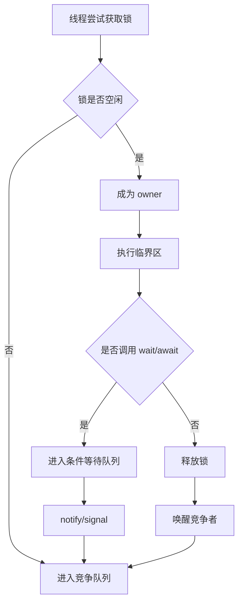
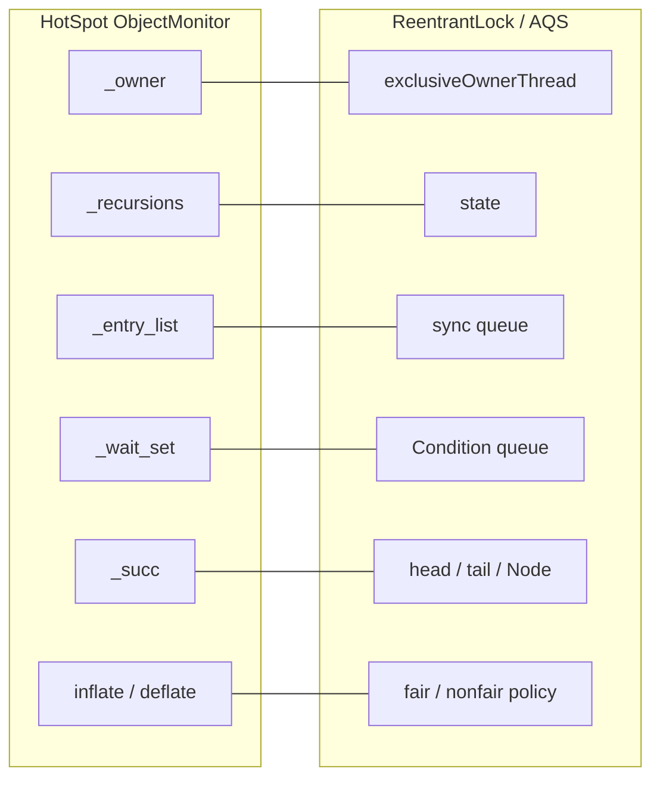
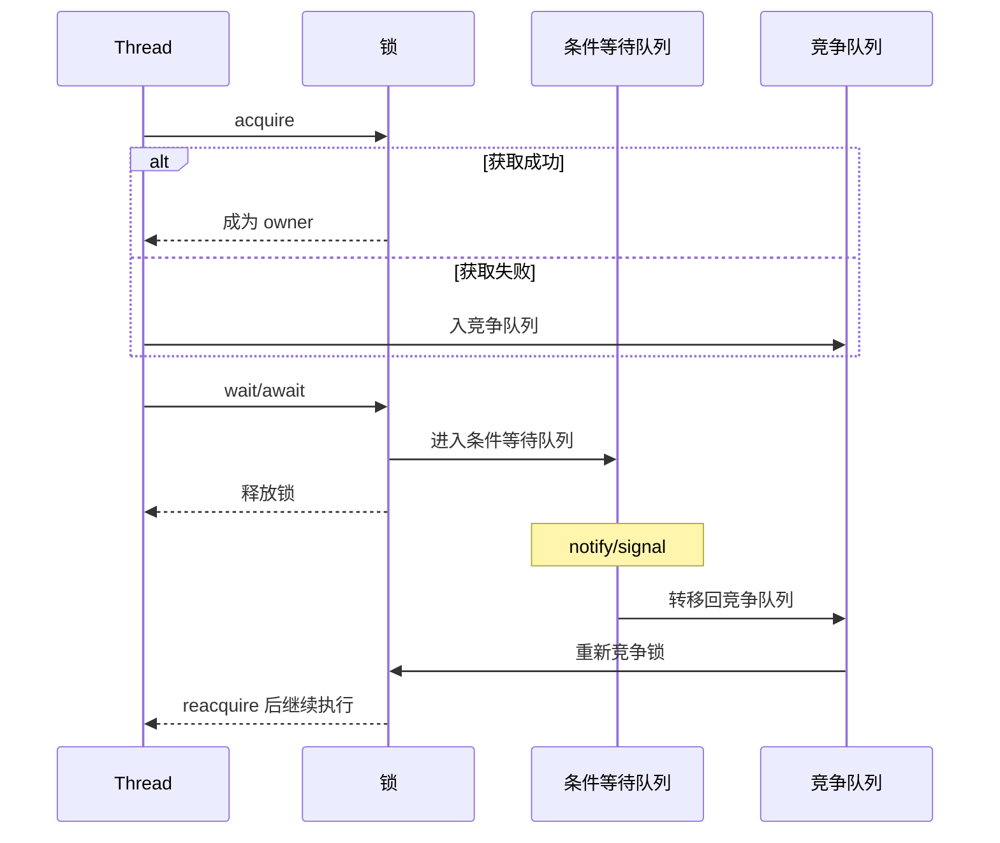

# 锁原理与差异汇总

## 1. `synchronized` 原理

### 1.1 本质

`synchronized` 是 Java 语言级内置的监视器锁（monitor）。每个对象都可以关联一个 monitor，同一时刻只允许一个线程持有；同一线程可以重复进入，因此它是**可重入锁**。

它提供的核心语义有三类：

- **互斥**：同一时刻只允许一个线程进入临界区
- **可见性**：释放锁前对共享变量的修改，对之后获取同一把锁的线程可见
- **有序性**：`unlock(m)` happens-before 后续对同一个 monitor 的 `lock(m)`

同时，`wait/notify/notifyAll` 机制也是建立在对象 monitor 之上的：

- 调用 `wait()` 前必须先持有对象锁
- `wait()` 会释放当前 monitor，并在被唤醒后重新竞争锁
- 不持有 monitor 调用 `wait/notify/notifyAll` 会抛 `IllegalMonitorStateException`

### 1.2 JVM 实现演进

要把 `synchronized` 分成“**语义**”与“**实现**”两层看：

- **语义层**：始终是 monitor 锁
- **实现层**：HotSpot 会根据 JDK 版本和竞争情况选择不同优化路径

历史上 HotSpot 常见实现路径包括：

- **偏向锁**：面向“总是同一线程反复获取”的场景，减少无竞争时同步开销
- **轻量级锁**：通过 CAS 等轻量机制处理短临界区、低竞争场景
- **重量级锁**：竞争激烈或涉及阻塞挂起、`wait()` 时，膨胀为 `ObjectMonitor`

但要注意：

- 偏向锁已经是**历史优化**，JDK 15 起默认禁用（JEP 374）
- 新版本 HotSpot 还在继续演进 lightweight locking 的实现

所以更准确的说法不是“`synchronized` 永远就是偏向锁 -> 轻量级锁 -> 重量级锁”，而是：

> `synchronized` 的语义固定为 monitor，JVM 会在不同版本中采用不同优化实现。

### 1.3 优缺点

优点：

- 语法级支持，代码简洁
- 自动释放锁，异常退出也不会漏解锁
- JVM 优化很多，简单互斥场景下性能并不差

缺点：

- 不支持超时获取
- 不支持显式可中断获取
- 只有一个 monitor wait set，复杂等待条件不够灵活
- 无公平性配置

---

## 2. `Lock` 与 `synchronized` 的差异

Java `Lock` 接口提供了比 `synchronized` 更灵活的锁控制能力，其中最常见实现是 `ReentrantLock`。

### 2.1 核心差异

| 维度 | `synchronized` | `ReentrantLock` |
|---|---|---|
| 形式 | 语言关键字 | API |
| 释放方式 | 自动释放 | 必须手动 `unlock()` |
| 可中断获取 | 不支持 | 支持 `lockInterruptibly()` |
| 非阻塞尝试 | 不支持 | 支持 `tryLock()` |
| 超时获取 | 不支持 | 支持 `tryLock(timeout, unit)` |
| 公平性 | 不支持配置 | 支持公平 / 非公平 |
| 条件变量 | 一个对象一套 wait set | 一个锁可绑定多个 `Condition` |
| 锁状态观测 | 弱 | 强，如 `isLocked()`、`hasQueuedThreads()` |

### 2.2 本质区别

`synchronized` 更像“语法内建的简单互斥机制”；
`ReentrantLock` 更像“可编程的高级锁工具”。

因此：

- 临界区简单，只要互斥和可见性时，优先考虑 `synchronized`
- 需要超时、中断、公平性、多条件队列时，优先考虑 `ReentrantLock`

### 2.3 `Condition` 与 `wait/notify`

`Condition` 可以看作把 `wait/notify` 从对象内建 monitor 中“拆出来”绑定到 `Lock` 上：

- `synchronized`：一个对象只有一套等待队列
- `ReentrantLock`：一个锁可以创建多个 `Condition`

这使得复杂并发控制更容易分离“不同等待条件”，避免所有线程都挤在同一个 wait set 中。

---

## 3. AQS 原理

### 3.1 AQS 是什么

AQS（`AbstractQueuedSynchronizer`）不是具体锁，而是 **Java 并发包中构建锁和同步器的基础框架**。

很多同步器都建立在 AQS 之上，例如：

- `ReentrantLock`
- `Semaphore`
- `CountDownLatch`
- `ReentrantReadWriteLock`

### 3.2 AQS 的核心模型

AQS 主要依赖两个核心：

1. **一个原子状态值 `state`**
2. **一个 FIFO 等待队列（CLH 变体）**

可理解为：

- `state` 代表同步状态
- 拿不到锁的线程进入队列排队
- 前驱节点释放资源后，唤醒后继节点继续竞争

### 3.3 `state` 的意义

AQS 本身不规定 `state` 的业务含义，具体由子类决定：

- `ReentrantLock`：`state` 表示重入次数
- `Semaphore`：`state` 表示剩余许可数
- `CountDownLatch`：`state` 表示剩余计数

### 3.4 获取锁的流程（独占模式）

典型流程如下：

1. 线程先尝试 `tryAcquire()`
2. 若成功，直接获得资源
3. 若失败，进入 AQS 队列排队
4. 当前驱释放后，被唤醒再次尝试获取
5. 成功后出队并继续执行

### 3.5 释放锁的流程

1. 调用 `tryRelease()` 修改状态
2. 若已完全释放资源，则唤醒队列中的后继节点

### 3.6 为什么 AQS 强大

因为它把“排队、阻塞、唤醒”等通用机制抽象出来，子类只需要回答几个问题：

- 什么叫获取成功？
- 什么叫释放成功？
- `state` 表示什么？

于是同一套框架就能支撑很多不同同步器。

### 3.7 公平与非公平

AQS **默认并不自动保证公平**。因为线程会先直接尝试获取资源，失败后才入队，所以新线程可能插队。

如果要实现公平，一般需要在 `tryAcquire()` 中主动判断：

- 队列前面是否已有等待者
- 如果有，则当前线程不插队，按顺序排队

这也是 `ReentrantLock` 公平锁与非公平锁的根本差异来源。

---

## 4. `ReentrantLock` 与 AQS 的关系

`ReentrantLock` 是 AQS 的一个典型应用。

其实现中有两个重要内部类：

- `NonfairSync`
- `FairSync`

它们都继承自 `AbstractQueuedSynchronizer`。

### 4.1 可重入的实现方式

`ReentrantLock` 通过 AQS 的 `state` 表示持锁次数：

- `state == 0`：无线程持锁
- 首次获取成功：CAS 将 `state` 从 0 改为 1
- 同一线程再次加锁：`state++`
- 解锁：`state--`
- 只有 `state` 递减到 0，才真正释放锁

因此它天然支持**同线程重复进入**。

### 4.2 公平锁与非公平锁

- **非公平锁**：新线程先直接尝试 CAS 抢锁，可能插队，吞吐量通常更高
- **公平锁**：会先判断队列前面是否已有线程等待，尽量按排队顺序获取

注意：

- 公平锁通常吞吐更低
- 即使是公平锁，无参 `tryLock()` 也不保证公平顺序

---

## 5. `synchronized` 总结

可以把 `synchronized` 概括成：

> Java 语言内置的 monitor 锁，语义简单稳定，适合处理单机 JVM 内的基础互斥问题。

### 5.1 适合场景

- 单机内线程同步
- 临界区逻辑简单
- 不需要超时、中断、公平性控制
- 更重视代码可读性和安全释放

### 5.2 不足

- 灵活性不如 `ReentrantLock`
- 不适合复杂等待条件
- 无法直接用于分布式场景

---

## 6. Redisson 实现的锁

### 6.1 本质

Redisson 的分布式锁本质上是：

> **Redis/Valkey 上的锁 key + TTL + watchdog 自动续期 + pub/sub 唤醒机制**

它为 Java 提供了类似 `Lock` 的分布式锁编程体验。

### 6.2 获取锁

典型流程：

1. 客户端尝试在 Redis 上创建锁记录
2. 成功则持有锁，并记录线程身份 / 重入信息
3. 如果获取失败，则订阅相关 channel，等待锁释放通知
4. 收到释放消息后重新竞争

### 6.3 释放锁

1. 只有持锁线程可以解锁
2. Redisson 会减少重入计数
3. 当计数归零时删除锁 key
4. 并通过 pub/sub 通知其他等待者继续抢锁

### 6.4 Watchdog 机制

Redisson 的关键特性是 **watchdog 自动续期**：

- 默认锁过期时间 30 秒
- 如果业务线程还活着，客户端会持续给锁续期
- 如果客户端崩溃，续期停止，锁会在 TTL 到期后自动释放

这解决了“服务宕机后锁永远不释放”的问题。

### 6.5 优势与风险

优势：

- 接入简单
- 性能通常较好
- 支持可重入、公平锁、多种高级锁模型

风险：

- 本质是基于 TTL 的分布式锁
- 如果显式 `leaseTime` 设置不合理，可能业务没做完锁就自动过期
- 正确性部分依赖客户端 watchdog 正常工作

---

## 7. ZooKeeper 实现的锁

### 7.1 本质

ZooKeeper 分布式锁的经典实现方式是：

> **临时顺序节点（ephemeral sequential znode） + watch 前驱节点**

### 7.2 获取锁流程

1. 在锁目录下创建一个临时顺序节点
2. 获取该目录下所有子节点并排序
3. 如果自己编号最小，获取锁成功
4. 否则监听前一个节点
5. 当前驱节点删除后，再判断自己是否成为最小节点

### 7.3 释放锁流程

- 删除自己创建的节点即可

### 7.4 为什么这种方案可靠

原因在于 ZooKeeper 提供了两个天然能力：

- **临时节点**：session 失效后自动删除
- **顺序节点**：天然给出全局有序排队关系

因此：

- 锁不依赖客户端手动续期
- 线程 / 进程崩溃后，只要 session 失效，锁就自动释放
- 排队关系天然清晰，公平性强

### 7.5 优势与不足

优势：

- 排队语义非常清晰
- 锁释放与 session 生命周期绑定，语义强
- 天然适合实现公平锁

不足：

- 实现与运维复杂度高于 Redis 方案
- 对 ZooKeeper 集群稳定性依赖强
- 吞吐通常不如基于 Redis 的轻量锁方案

---

## 8. Etcd 实现锁的原理与差异

### 8.1 本质

etcd 锁本质上是：

> **绑定到 lease 的 key + 按 create revision 排序 + watch 等待前序 key 删除**

它与 ZooKeeper 的思路相似，但顺序不是靠顺序节点名，而是靠 etcd 内部的 revision。

### 8.2 获取锁流程

1. 创建绑定到当前 lease 的 key
2. 读取同名前缀下所有竞争 key
3. 如果自己的 create revision 最小，则获取锁成功
4. 否则等待比自己 revision 更小的 key 被删除
5. 前驱消失后再次确认自己是否仍有效，成功后获得锁

### 8.3 释放锁流程

- 显式 `Unlock()` 删除自己的 key
- 或 lease 到期后由 etcd 自动删除 key

### 8.4 为什么 etcd 锁很适合一致性场景

因为 etcd 本身提供：

- 一致性保证
- lease
- watch
- revision
- 事务

所以 etcd 锁不仅能实现互斥，还能和事务组合，做到“只有持锁者才能安全更新特定状态”。

### 8.5 优势与不足

优势：

- 锁语义建立在 etcd 的一致性和 lease 上
- 自动释放由服务端 lease 机制保障
- 可自然与事务和 watch 能力整合

不足：

- 系统复杂度比 Redis 锁更高
- leader 切换、keepalive、lease 过期等语义需要额外理解
- 通常比 Redis 锁更重、更偏基础设施级协调

---

## 9. Redisson / ZooKeeper / Etcd 的差异总结

| 维度 | Redisson | ZooKeeper | etcd |
|---|---|---|---|
| 底层依赖 | Redis / Valkey | ZooKeeper | etcd |
| 锁载体 | key + TTL | 临时顺序节点 | 绑定 lease 的 key |
| 自动释放依据 | TTL 到期 | session 失效 | lease 过期 |
| 顺序依据 | 普通锁弱；公平锁额外实现 | 顺序节点编号 | create revision |
| 唤醒方式 | pub/sub | watch 前驱节点 | watch 前序 key |
| 是否依赖客户端续期 | 是，watchdog | 否 | 依赖 lease keepalive |
| 公平性 | 普通锁不强调，公平锁可选 | 天然较强 | 有顺序，但语义上不如 ZooKeeper 直观 |
| 实现复杂度 | 低 | 中高 | 中高 |
| 适用场景 | 业务系统快速接入分布式锁 | 强协调、强顺序场景 | 一致性和事务协同场景 |

---

## 10. 最终结论

### 10.1 单机 JVM 内部锁

- `synchronized`：简单、稳定、自动释放，适合基础互斥
- `ReentrantLock`：更灵活，适合复杂线程同步需求
- AQS：是很多并发同步器的底层框架，不直接面向业务使用，但必须理解它才能真正理解 JUC 锁体系

### 10.2 分布式锁

- **Redisson**：更偏工程易用与高性能，适合业务系统快速落地
- **ZooKeeper**：更偏协调系统语义，公平性和排队逻辑最直观
- **etcd**：更偏一致性与事务结合，适合基础设施级协调场景

### 10.3 一句话记忆

- `synchronized`：**JVM 内建 monitor 锁**
- `ReentrantLock`：**基于 AQS 的可编程锁**
- Redisson：**基于 Redis TTL + watchdog 的分布式锁**
- ZooKeeper：**基于临时顺序节点的分布式锁**
- etcd：**基于 lease + revision 排队的分布式锁**

---

## 11. 深入对比：HotSpot `ObjectMonitor` vs Java `Lock/AQS`

这一节不再停留在 API 层，而是从 **OpenJDK HotSpot C++ 源码里的 `ObjectMonitor`** 和 **Java 源码里的 `ReentrantLock/AQS`** 做机制级对比。

### 11.1 先用相同点建立记忆框架

可以先把两者都记成一句话：

> 它们本质上都是：**一个 owner + 一个竞争队列 + 一个条件等待队列 + 一套唤醒后重新竞争的机制**。

也就是说，不管是：

- `synchronized` 背后的 `ObjectMonitor`
- `ReentrantLock` 背后的 AQS

它们都要解决四个核心问题：

1. 当前锁被谁持有
2. 获取失败的线程在哪里排队
3. 调用了 `wait/await` 的线程在哪里等待
4. 被唤醒后如何重新回来竞争锁

### 11.2 相同点总览

| 共同概念 | `ObjectMonitor` | `ReentrantLock/AQS` |
|---|---|---|
| 持有者 | `_owner` | `exclusiveOwnerThread` |
| 重入计数 | `_recursions` | `state` |
| 竞争队列 | `_entry_list` | AQS sync queue |
| 条件等待队列 | `_wait_set` | `ConditionObject` queue |
| 阻塞/唤醒 | JVM 运行时挂起/恢复线程 | `LockSupport.park/unpark` |
| 唤醒后的语义 | 回到竞争路径重新抢锁 | 回到竞争路径重新抢锁 |

所以第一层记忆可以直接记成：

> 两者的骨架其实很像，只是一个在 JVM 里实现，一个在 Java 并发框架里实现。

### 11.3 结构图：先看共同骨架

---

### 11.4 第一层核心差异：`ObjectMonitor` 是 JVM 运行时监视器，AQS 是 Java 锁框架

这是最重要的一句话：

> **`ObjectMonitor` 是 JVM 内部的监视器运行时对象；`ReentrantLock` 是 Java 层基于 AQS 搭出来的可编程锁。**

展开后可以分成几个关键差异。

#### 1）`ObjectMonitor` 先有对象头快路径，AQS 没有

`synchronized` 对应的 `monitorenter/monitorexit` 并不是一上来就进入 `ObjectMonitor`。

HotSpot 会先走对象头（mark word）上的快路径，只有在以下场景才进入 inflated monitor，也就是 `ObjectMonitor`：

- 出现竞争
- 需要膨胀
- 调用了 `wait()`
- 快路径无法完成加锁/解锁

相关入口在 HotSpot 里主要是：

- `ObjectSynchronizer::enter`
- `ObjectSynchronizer::exit`
- `inflate_and_enter`
- `inflate_locked_or_imse`

而 `ReentrantLock/AQS` 没有“对象头快路径 -> 膨胀”的概念，它从一开始就是：

- Java 对象
- Java 字段
- Java CAS
- Java 队列
- `LockSupport.park/unpark`

记忆方式：

> `synchronized` 先尝试“轻量快路径”，不行再进入 `ObjectMonitor`；AQS 从一开始就是显式同步器。

#### 2）`ObjectMonitor` 是 VM sidecar，AQS 是锁对象本体

`ObjectMonitor` 不是普通 Java 锁对象内部的字段结构，而是 HotSpot 运行时里的 C++ monitor 对象。它可能通过：

- 对象头中的 mark word
- 或现代 OpenJDK 中的 `ObjectMonitorTable`

与 Java 对象关联。

而 AQS 不一样，它本身就是锁对象内部的状态机：

- `state`
- `head`
- `tail`
- `Node`
- `ConditionObject`

这些都直接在 Java 堆对象中。

记忆方式：

> `ObjectMonitor` 更像“对象外挂的 JVM 监视器”；AQS 更像“锁对象自己就是状态机”。

#### 3）`ObjectMonitor` 要处理膨胀与 deflation，AQS 不需要

HotSpot 里的 `ObjectMonitor` 是 JVM 运行时资源，所以必须处理：

- **inflation**：从对象头快路径膨胀为 monitor
- **deflation**：当 monitor 空闲且安全时回收/收缩

这会引出一些 AQS 根本没有的概念：

- `ANONYMOUS_OWNER`
- `DEFLATER_MARKER`
- `_contentions`
- `_waiters`
- monitor 生命周期管理

相关函数：

- `ObjectMonitor::deflate_monitor`
- `enter_is_async_deflating`

而 AQS 是普通 Java 对象：

- 生命周期交给 GC
- 不需要处理 native monitor 的回收协议

记忆方式：

> `ObjectMonitor` 不只是锁，还要做运行时资源管理；AQS 只做同步状态管理。

---

### 11.5 owner / 重入计数 的差异

#### `ObjectMonitor`

HotSpot 里最关键的字段包括：

- `_owner`
- `_recursions`
- `_entry_list`
- `_wait_set`
- `_succ`
- `_contentions`
- `_waiters`

其中：

- `_owner`：当前 monitor 持有者
- `_recursions`：重入计数

但 `_owner` 并不是简单的“当前线程指针”，还可能出现特殊 owner 状态，例如：

- `NO_OWNER`
- `ANONYMOUS_OWNER`
- `DEFLATER_MARKER`

这些都是 HotSpot 为膨胀、过渡态、deflation 协议准备的。

#### `ReentrantLock/AQS`

`ReentrantLock` 的 owner 语义更直接：

- `exclusiveOwnerThread`：持有线程
- `state`：重入层数

对于 `ReentrantLock`：

- `state == 0`：未持锁
- `state > 0`：已持锁，数值就是重入次数

记忆方式：

> `ObjectMonitor` 的 owner 管理要兼顾 JVM 内部过渡状态；AQS 的 owner 管理只是普通同步器状态管理。

---

### 11.6 竞争队列的差异

#### `ObjectMonitor`

竞争线程主要进入：

- `_entry_list`

同时还配合：

- `_succ`
- `_contentions`

HotSpot 里的唤醒策略是 **competitive handoff**：

- 解锁线程不会把 owner 直接交给某个等待线程
- 它只会选择一个候选 successor
- 被唤醒线程仍然要重新竞争 `_owner`

这点非常关键，因为它说明：

> monitor 的唤醒不是“直接交锁”，而是“通知你可以回来抢锁了”。

#### AQS

AQS 的同步队列结构更显式：

- `head`
- `tail`
- `Node.prev`
- `Node.next`
- `Node.waiter`
- `Node.status`

线程获取失败后的典型流程：

1. 先 `tryAcquire()`
2. 失败后入 AQS sync queue
3. 在前驱释放后被唤醒
4. 再次 `tryAcquire()`
5. 成功后成为新的 head 附近节点并继续执行

记忆方式：

> `ObjectMonitor` 的竞争队列是 JVM 专用运行时队列；AQS 的竞争队列是 Java 层显式 CLH 风格队列。

---

### 11.7 条件等待队列的差异

#### 相同点

无论是 `wait/notify` 还是 `await/signal`，本质都遵循同一个流程：

1. 当前线程必须先持有锁
2. 进入条件等待队列
3. 完整释放锁
4. 挂起等待
5. 被唤醒后重新进入竞争路径
6. 重新获取锁后再继续执行

这一点是最适合建立记忆锚点的地方：

> `wait` 和 `await` 的本质都不是“睡眠”，而是“释放锁后等待，再带着原上下文回来重新拿锁”。

#### `ObjectMonitor`

调用 `wait()` 后线程进入：

- `_wait_set`

被 `notify/notifyAll()` 唤醒后，不是直接运行，而是：

- 从 `_wait_set` 转移回 `_entry_list`
- 然后继续竞争 `_owner`

#### `ReentrantLock/AQS`

调用 `Condition.await()` 后线程进入：

- `ConditionObject` 维护的 condition queue

被 `signal/signalAll()` 后：

- 节点从 condition queue 转移到 AQS sync queue
- 后续再走 acquire 流程重拿锁

#### 真正差异

`ObjectMonitor` 一个 monitor 只有一套：

- `_wait_set`

`ReentrantLock` 一个锁可以有多个：

- `ConditionObject`

也就是说：

- monitor：单条件等待队列
- AQS/Condition：多条件等待队列

记忆方式：

> monitor 的条件等待是“单队列”；AQS/Condition 的条件等待是“多队列”。

---

### 11.8 公平性与策略能力差异

#### `ObjectMonitor`

`synchronized` 不给开发者暴露公平锁选项。HotSpot 的目标更多是：

- 正确性
- 吞吐量
- 竞争优化

而不是让业务代码配置公平/非公平策略。

#### `ReentrantLock`

`ReentrantLock` 明确区分：

- `NonfairSync`
- `FairSync`

非公平锁：

- 新线程先直接 CAS 抢锁
- 允许插队

公平锁：

- 获取前先判断 `hasQueuedPredecessors()`
- 有前驱就不能插队

记忆方式：

> `ObjectMonitor` 的调度策略是 JVM 内部策略；AQS 的调度策略是 API 可配置策略。

---

### 11.9 中断、超时、可观测性差异

#### `ObjectMonitor / synchronized`

不直接提供：

- `tryLock()`
- `lockInterruptibly()`
- 超时获取锁
- 多条件队列
- 丰富的队列状态观测 API

#### `ReentrantLock`

提供：

- `tryLock()`
- `tryLock(timeout, unit)`
- `lockInterruptibly()`
- `newCondition()`
- `isLocked()`
- `hasQueuedThreads()`
- `getHoldCount()`

记忆方式：

> `ObjectMonitor` 更像 JVM 内建标准锁；`ReentrantLock` 更像可编排的高级并发工具。

---

### 11.10 对照结构图：`ObjectMonitor` vs `ReentrantLock/AQS`

再用一张更偏过程的图帮助记忆：

---

### 11.11 最后总结成一句记忆口诀

> **先记相同：都有 owner、竞争队列、条件队列、唤醒后重抢。**  
> **再记差异：`ObjectMonitor` 是 JVM 监视器，要处理对象头、膨胀、deflation；AQS 是 Java 状态机，要处理 `state`、CLH 队列、`Condition` 和公平策略。**

再压缩成一句：

> **`synchronized` 是 JVM 帮你管的锁，`ReentrantLock` 是你通过 AQS 使用的可编程锁。**

---

## 参考资料

### Java / JDK

1. JLS Chapter 17  
   https://docs.oracle.com/javase/specs/jls/se21/html/jls-17.html

2. Lock API  
   https://docs.oracle.com/en/java/javase/26/docs/api/java.base/java/util/concurrent/locks/Lock.html

3. ReentrantLock API  
   https://docs.oracle.com/en/java/javase/26/docs/api/java.base/java/util/concurrent/locks/ReentrantLock.html

4. AQS API  
   https://docs.oracle.com/en/java/javase/26/docs/api/java.base/java/util/concurrent/locks/AbstractQueuedSynchronizer.html

5. OpenJDK `ReentrantLock.java`  
   https://github.com/openjdk/jdk/blob/master/src/java.base/share/classes/java/util/concurrent/locks/ReentrantLock.java

6. OpenJDK `AbstractQueuedSynchronizer.java`  
   https://github.com/openjdk/jdk/blob/master/src/java.base/share/classes/java/util/concurrent/locks/AbstractQueuedSynchronizer.java

7. JEP 374  
   https://openjdk.org/jeps/374

8. OpenJDK Wiki: Synchronization Using The ObjectMonitorTable  
   https://wiki.openjdk.org/spaces/HotSpot/pages/138215471/Synchronization+Using+The+ObjectMonitorTable

9. OpenJDK HotSpot `objectMonitor.hpp`  
   https://github.com/openjdk/jdk/blob/master/src/hotspot/share/runtime/objectMonitor.hpp

10. OpenJDK HotSpot `objectMonitor.cpp`  
    https://github.com/openjdk/jdk/blob/master/src/hotspot/share/runtime/objectMonitor.cpp

11. OpenJDK HotSpot `objectMonitor.inline.hpp`  
    https://github.com/openjdk/jdk/blob/master/src/hotspot/share/runtime/objectMonitor.inline.hpp

12. OpenJDK HotSpot `synchronizer.cpp`  
    https://github.com/openjdk/jdk/blob/master/src/hotspot/share/runtime/synchronizer.cpp

13. OpenJDK HotSpot `synchronizer.hpp`  
    https://github.com/openjdk/jdk/blob/master/src/hotspot/share/runtime/synchronizer.hpp

### Redisson

14. Redisson Reference Guide, Locks and synchronizers  
   https://redisson.org/docs/data-and-services/locks-and-synchronizers/

15. Redisson configuration  
    https://github.com/redisson/redisson/blob/master/docs/configuration.md

### ZooKeeper / Curator

16. Apache ZooKeeper Recipes and Solutions  
    https://zookeeper.apache.org/doc/current/recipes.html

17. Apache Curator Shared Reentrant Lock  
    https://curator.apache.org/docs/recipes-shared-reentrant-lock/

18. Apache Curator InterProcessMutex API  
    https://curator.apache.org/apidocs/org/apache/curator/framework/recipes/locks/InterProcessMutex.html

### etcd

19. etcd Concurrency API Reference  
    https://etcd.io/docs/v3.6/dev-guide/api_concurrency_reference_v3/

20. etcd client concurrency mutex source  
    https://github.com/etcd-io/etcd/blob/main/client/v3/concurrency/mutex.go

21. etcd API / Lease  
    https://etcd.io/docs/v3.7/learning/api

22. etcd Failure modes  
    https://etcd.io/docs/v3.5/op-guide/failures/
