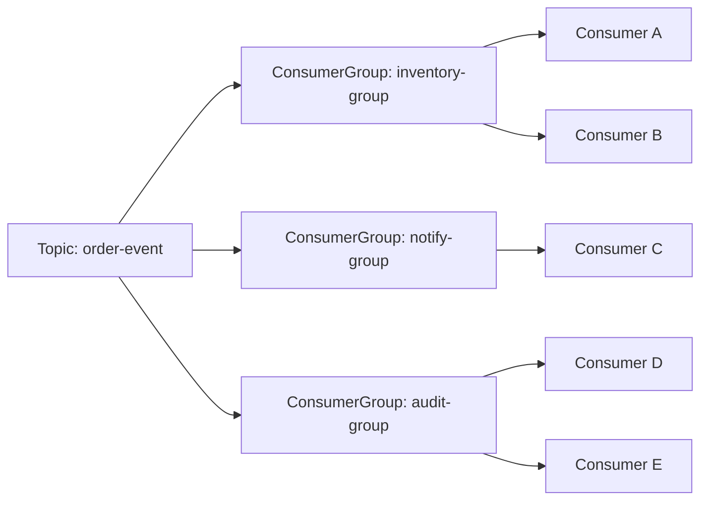
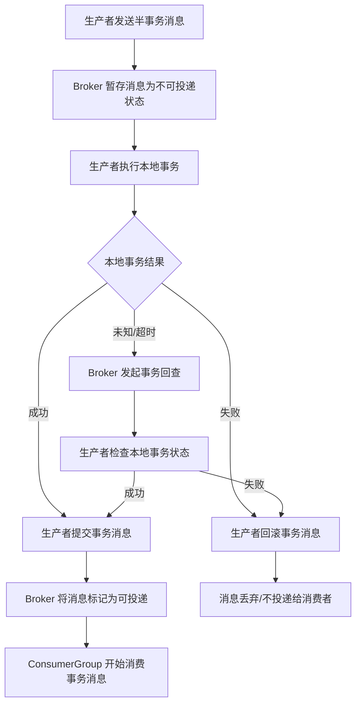
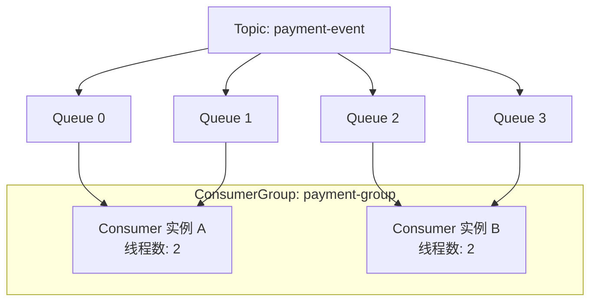

# RocketMQ 使用总结

本文基于 RocketMQ 官方文档与 Apache 官方 `rocketmq-spring` 项目资料整理，重点总结 RocketMQ 的使用方式、关键概念、Spring Boot 集成方式，以及 4.x 与 5.0 的主要差异。

## 1. RocketMQ 是什么

RocketMQ 是 Apache 开源的分布式消息中间件，特点是：

- 高吞吐、低延迟
- 支持高可靠消息投递
- 支持普通消息、顺序消息、延时/定时消息、事务消息
- 支持水平扩展
- 适合异步解耦、削峰填谷、最终一致性、事件驱动等场景

官方文档强调，RocketMQ 特别适合金融级可靠消息场景、互联网高并发业务场景，以及需要消息轨迹、重试、顺序性、事务保障的业务系统。

---

## 2. RocketMQ 的核心使用场景

RocketMQ 在项目里常见的使用方式包括：

### 2.1 异步解耦

例如用户下单后：

- 订单服务写订单
- 发送“订单已创建”消息
- 库存服务、积分服务、通知服务分别异步消费

优点：

- 降低服务耦合
- 提高主链路响应速度
- 下游故障不会直接阻塞上游

### 2.2 削峰填谷

例如秒杀、抢购、批量任务等瞬时高并发场景：

- 前端请求先写入消息队列
- 后端消费者按可控速度处理

优点：

- 降低数据库和下游服务瞬时压力
- 防止系统被突发流量打垮

### 2.3 事件驱动

业务状态变化后发布领域事件，例如：

- 用户注册成功
- 支付成功
- 商品审核通过

下游系统基于订阅关系处理事件。

### 2.4 最终一致性

通过事务消息或可靠消息机制，把本地事务和异步事件传播结合起来，用于：

- 订单与支付状态联动
- 账户余额变更
- 跨系统业务一致性

---

## 3. RocketMQ 关键概念

RocketMQ 5.0 在官方文档中对领域模型做了更清晰的定义。

### 3.1 Topic

主题，消息的逻辑分类。

生产者把消息发送到 Topic，消费者订阅 Topic 获取消息。

可以把 Topic 理解为“业务消息类别”，例如：

- `order-created`
- `payment-success`
- `user-register`

### 3.2 Message

消息本体，通常包含：

- 消息体 body
- tag
- key
- 属性（properties）

其中：

- **Tag**：用于轻量分类
- **Key**：用于业务唯一标识和排查问题

### 3.3 MessageQueue

消息队列，是 Topic 在 Broker 上的物理分片。

一个 Topic 会包含多个 MessageQueue，用于：

- 并行存储
- 并行消费
- 水平扩展

### 3.3.1 Topic 与 Queue 的关系

可以把它理解为：

- **Topic 是逻辑主题**
- **Queue 是 Topic 的物理分片**

一个 Topic 往往对应多个 Queue。生产者发送到 Topic 后，RocketMQ 会按照负载均衡、顺序键或指定策略，把消息落到某一个 Queue 上。

示意关系：

```text
Topic: order-event
├── Queue 0
├── Queue 1
├── Queue 2
└── Queue 3
```

这意味着：

- Topic 决定“这是什么业务消息”
- Queue 决定“这条消息落在哪个分片上”
- Topic 的并发消费能力，通常和其 Queue 数量强相关

### 3.3.2 Topic / Queue 配置的正确与错误示例

#### 正确示例 1：高并发 Topic 配置多个 Queue

场景：订单事件 Topic 需要支持高并发消费。

```text
Topic: order-event
Queue 数: 8
ConsumerGroup: order-consumer-group
Consumer 实例数: 4
```

这个配置的特点：

- Queue 数量大于 1，可并行消费
- 4 个消费者实例可以分摊 8 个 Queue
- 后续还能继续横向扩容

#### 正确示例 2：顺序消息按业务键路由到固定 Queue

场景：订单状态流转要求同一订单严格有序。

```text
Topic: order-status
Queue 数: 4
路由键: orderId
相同 orderId 始终进入同一个 Queue
```

这个配置的特点：

- 同一个 `orderId` 落在同一个 Queue
- 可保证单订单维度有序
- 不同订单仍可分散到不同 Queue 提升吞吐

#### 错误示例 1：高吞吐 Topic 只配置 1 个 Queue

```text
Topic: coupon-send
Queue 数: 1
ConsumerGroup: coupon-consumer-group
Consumer 实例数: 10
```

问题：

- 实际只有 1 个 Queue 可消费
- 10 个消费者里大部分实例会闲置
- 整个 Topic 的并发消费能力被单 Queue 限死

#### 错误示例 2：顺序消息随机落 Queue

```text
Topic: order-status
顺序要求: 同一订单必须有序
发送策略: 随机发送到任意 Queue
```

问题：

- 同一订单的消息可能进入不同 Queue
- 消费时无法保证单订单顺序
- 业务容易出现状态错乱

### 3.4 Producer

生产者，负责发送消息到 RocketMQ。

Producer 通常关心：

- 发往哪个 Topic
- 是否同步发送 / 异步发送 / 单向发送
- 是否发送顺序消息
- 是否发送事务消息

### 3.5 Consumer / ConsumerGroup

- **Consumer**：实际执行消费逻辑的客户端实例
- **ConsumerGroup**：消费者分组，同一组内共同消费同一份订阅数据

消费组的意义：

- 一组消费者共享消费负载
- 不同消费组可以分别消费同一 Topic，实现广播式业务扩展

### 3.5.1 Consumer 与 ConsumerGroup 的关系

可以把它理解为：

- **ConsumerGroup 是消费身份**
- **Consumer 是这个身份下运行的具体实例**

示意关系：

```text
Topic: order-event

ConsumerGroup: order-fulfillment-group
├── Consumer 实例 A
├── Consumer 实例 B
└── Consumer 实例 C

ConsumerGroup: order-audit-group
├── Consumer 实例 D
└── Consumer 实例 E
```

这里表示：

- `order-fulfillment-group` 这一组共同消费一份 `order-event`
- `order-audit-group` 也会独立消费同一 Topic 的一份完整数据
- **不同消费组之间彼此独立**
- **同一消费组内多个实例用于分摊负载**

#### 一个 Topic 被多个 ConsumerGroup 同时消费的图解



这个图表示：

- 同一个 Topic 可以被多个 ConsumerGroup 同时订阅
- 每个 ConsumerGroup 都会独立获得自己的一份消息流
- 组内多个 Consumer 实例只是在共享本组的消费负载
- 组与组之间不会共享消费位点

因此：

- “发通知”和“扣库存”应该是不同 ConsumerGroup
- “同一个业务扩容”才应该在同一个 ConsumerGroup 里加实例

### 3.5.2 ConsumerGroup 配置的正确与错误示例

#### 正确示例 1：不同业务使用不同 ConsumerGroup

```text
Topic: order-event

ConsumerGroup A: inventory-deduct-group
用途: 扣减库存

ConsumerGroup B: order-notify-group
用途: 发送通知

ConsumerGroup C: order-risk-group
用途: 风控检查
```

这个配置的优点：

- 每个消费组职责单一
- 各自拥有独立消费进度
- 某个业务失败不会污染其他业务消费位点

#### 正确示例 2：同一业务横向扩容时复用同一 ConsumerGroup

```text
Topic: payment-success
ConsumerGroup: payment-accounting-group
实例数: 1 -> 3
```

这个配置的意义：

- 业务语义没变，只是扩容
- 仍属于同一个消费组
- 多个实例共同分摊同一份消息流量

#### 错误示例 1：多个完全不同业务复用同一个 ConsumerGroup

```text
Topic: user-event
ConsumerGroup: user-common-group

消费者 1: 发优惠券
消费者 2: 发欢迎短信
消费者 3: 写审计日志
```

问题：

- 同一消费组内是“共同消费一份数据”，不是“每个实例各消费一遍”
- 结果可能是某条消息只被其中一个实例处理
- 不同业务会互相抢消息，造成业务缺失

#### 错误示例 2：同一业务拆成多个 ConsumerGroup 但误以为能共享位点

```text
Topic: payment-success
ConsumerGroup A: accounting-group-v1
ConsumerGroup B: accounting-group-v2
```

问题：

- 两个消费组会分别消费各自的一整份消息
- 如果业务方误以为这是“主备”，可能导致重复入账
- 只有在明确需要双写、回放、灰度验证时才适合这样设计

### 3.5.3 配置原则总结

#### Topic 设计原则

- 按业务域或事件类型划分 Topic
- 高吞吐 Topic 需要足够多的 Queue
- 顺序 Topic 需要配合稳定路由键

#### ConsumerGroup 设计原则

- 一个 ConsumerGroup 对应一类明确业务职责
- 同组多实例表示扩容，不表示多业务并存
- 需要独立消费、独立位点、独立失败隔离时，应拆成不同 ConsumerGroup

### 3.6 Subscription

订阅关系，描述某个消费组订阅哪个 Topic，以及使用什么过滤规则。

### 3.7 Offset

消费位点，表示消费者消费到了哪里。

它决定：

- 消费是否重复
- 宕机恢复后从哪里继续
- 是否支持重置消费进度

### 3.8 MessageType

RocketMQ 5.0 明确支持以下消息类型：

- `NORMAL`：普通消息
- `FIFO`：顺序消息
- `DELAY`：延时/定时消息
- `TRANSACTION`：事务消息

5.0 开始，官方强调 Topic 与消息类型之间的约束关系更清晰，一个 Topic 通常只对应一种消息类型。

---

## 4. RocketMQ 的主要消息类型与使用方式

### 4.1 普通消息

最常见，用于异步通知、事件分发、业务解耦。

适合：

- 订单创建通知
- 用户行为埋点
- 发送短信、邮件任务

### 4.2 顺序消息

用于要求同一业务实体内消息顺序一致的场景，例如：

- 订单创建 → 支付 → 发货 → 完成

RocketMQ 5.0 用 **MessageGroup** 来表达顺序性归属，即“同一消息组内有序”。

### 4.3 延时/定时消息

用于未来某个时间点再投递消息，例如：

- 订单超时自动取消
- 预约提醒
- 定时状态检查

### 4.4 事务消息

用于本地事务与消息投递联动。

典型流程：

1. 先发送半事务消息
2. 执行本地事务
3. 提交或回滚消息
4. Broker 在不确定时可回查事务状态

适合：

- 下单后同步冻结库存
- 支付成功后触发后续异步流程
- 跨服务最终一致性

#### 事务消息消费 / 提交流程图



注意：

- 消费者只会消费 **已提交** 的事务消息
- 半事务消息不会立即被消费者看到
- 如果生产者迟迟不返回确定状态，Broker 会触发事务回查
- 消费端仍然要保证幂等，因为事务消息不等于消费端绝对不会重复

---

## 5. RocketMQ 的基础使用流程

### 5.1 生产消息

典型流程：

1. 创建 Producer
2. 配置 NameServer 或 Endpoint
3. 启动 Producer
4. 构造消息
5. 调用发送 API

常见发送方式：

- 同步发送
- 异步发送
- 单向发送
- 顺序发送
- 事务发送

### 5.2 消费消息

典型流程：

1. 创建 Consumer
2. 指定 ConsumerGroup
3. 订阅 Topic
4. 注册消息处理逻辑
5. 启动 Consumer

消费者需要关注：

- 消费模式
- 并发度
- 重试策略
- 幂等处理
- 失败告警与日志

### 5.3 消息过滤

RocketMQ 支持：

- Tag 过滤
- SQL92 属性过滤

适合在一个 Topic 下进行细粒度消费控制。

### 5.4 消费重试

消费者消费失败时，可由 RocketMQ 触发重试。

需要重点注意：

- 消费逻辑必须幂等
- 失败不能无限重试不加控制
- 需要设计死信队列处理策略

---

## 6. RocketMQ 最佳实践

根据官方最佳实践，使用时应重点关注以下事项。

### 6.1 合理设计 Topic 与 ConsumerGroup

- Topic 尽量按业务域划分
- ConsumerGroup 尽量职责单一
- 不要让一个消费组消费完全不相关的多类消息

### 6.2 为消息设置 Keys

建议为每条业务消息设置唯一 Key，便于：

- 查询消息轨迹
- 故障排查
- 业务对账

### 6.3 消费逻辑必须幂等

因为消息系统天然可能出现：

- 重试
- 重投
- 网络抖动导致重复消费

所以消费端要能安全重复执行。

### 6.4 不要把复杂事务直接塞进消费逻辑

建议：

- 消费逻辑尽量短小
- 核心操作可重入
- 异常路径清晰可观测

### 6.5 做好日志、监控和告警

至少应记录：

- message key
- topic
- tag
- 消费组
- 重试次数
- 失败原因

---

## 7. 与 Spring Boot 的集成

RocketMQ 在 Spring Boot 中的官方集成项目是 `rocketmq-spring`。

### 7.1 依赖选择

官方仓库当前存在两条集成线：

#### 传统 Spring Boot starter

```xml
<dependency>
  <groupId>org.apache.rocketmq</groupId>
  <artifactId>rocketmq-spring-boot-starter</artifactId>
  <version>${rocketmq.spring.version}</version>
</dependency>
```

#### RocketMQ 5.x client starter

```xml
<dependency>
  <groupId>org.apache.rocketmq</groupId>
  <artifactId>rocketmq-v5-client-spring-boot-starter</artifactId>
  <version>${rocketmq.spring.version}</version>
</dependency>
```

接入前应先确认项目采用的是哪一条技术路线，不要混用理解。

### 7.2 基础配置

传统配置常见写法：

```properties
rocketmq.name-server=127.0.0.1:9876
rocketmq.producer.group=my-group
```

多个 NameServer 可用 `;` 分隔：

```properties
rocketmq.name-server=172.19.0.1:9876;172.19.0.2:9876
```

### 7.3 生产者集成

官方推荐通过 `RocketMQTemplate` 发送消息。

常见 API 包括：

- `convertAndSend`
- `send`
- `asyncSend`
- `syncSendOrderly`
- `sendMessageInTransaction`

示例：

```java
rocketMQTemplate.convertAndSend("test-topic", "Hello RocketMQ");
```

使用 Tag：

```java
rocketMQTemplate.convertAndSend("topicA:tagA", payload);
```

如果要设置消息 Key，通常通过 Spring `Message` header 传入。

### 7.4 消费者集成

官方常见方式是：

- 使用 `@RocketMQMessageListener`
- 实现 `RocketMQListener<T>`

例如：

```java
@Service
@RocketMQMessageListener(topic = "test-topic", consumerGroup = "test-consumer-group")
public class DemoConsumer implements RocketMQListener<String> {
    @Override
    public void onMessage(String message) {
        System.out.println(message);
    }
}
```

如果要拿到底层原生消息属性，可使用：

```java
RocketMQListener<MessageExt>
```

### 7.5 核心注解与类

Spring Boot 集成里最常见的是：

- `RocketMQTemplate`
- `@RocketMQMessageListener`
- `@RocketMQTransactionListener`
- `RocketMQLocalTransactionListener`
- `@ExtRocketMQTemplateConfiguration`

### 7.6 事务消息集成

发送事务消息：

```java
rocketMQTemplate.sendMessageInTransaction(...)
```

本地事务处理器一般：

- 使用 `@RocketMQTransactionListener`
- 实现 `RocketMQLocalTransactionListener`

并实现：

- `executeLocalTransaction`
- `checkLocalTransaction`

#### Spring Boot 事务消息代码示例

发送端示例：

```java
import org.apache.rocketmq.client.producer.SendResult;
import org.apache.rocketmq.common.message.MessageConst;
import org.springframework.messaging.Message;
import org.springframework.messaging.support.MessageBuilder;
import org.springframework.stereotype.Service;
import org.apache.rocketmq.spring.core.RocketMQTemplate;

@Service
public class OrderTransactionProducer {

    private final RocketMQTemplate rocketMQTemplate;

    public OrderTransactionProducer(RocketMQTemplate rocketMQTemplate) {
        this.rocketMQTemplate = rocketMQTemplate;
    }

    public SendResult createOrder(Long orderId) {
        Message<String> message = MessageBuilder.withPayload("order-created:" + orderId)
                .setHeader(MessageConst.PROPERTY_KEYS, "ORDER_" + orderId)
                .build();

        // 第三个参数通常传业务参数，供本地事务执行时使用
        return rocketMQTemplate.sendMessageInTransaction(
                "order-tx-topic",
                message,
                orderId
        );
    }
}
```

本地事务监听器示例：

```java
import org.apache.rocketmq.spring.annotation.RocketMQTransactionListener;
import org.apache.rocketmq.spring.core.RocketMQLocalTransactionListener;
import org.apache.rocketmq.spring.core.RocketMQLocalTransactionState;
import org.springframework.messaging.Message;
import org.springframework.stereotype.Component;

@Component
@RocketMQTransactionListener
public class OrderTransactionListener implements RocketMQLocalTransactionListener {

    @Override
    public RocketMQLocalTransactionState executeLocalTransaction(Message msg, Object arg) {
        Long orderId = (Long) arg;
        try {
            // 1. 执行业务本地事务，例如写订单表、冻结库存等
            // orderService.createOrder(orderId);

            // 2. 本地事务成功，提交事务消息
            return RocketMQLocalTransactionState.COMMIT;
        } catch (Exception ex) {
            // 本地事务失败，回滚事务消息
            return RocketMQLocalTransactionState.ROLLBACK;
        }
    }

    @Override
    public RocketMQLocalTransactionState checkLocalTransaction(Message msg) {
        try {
            // 根据消息 key 或业务参数查询本地事务最终状态
            // boolean success = orderService.existsSuccessOrder(...);
            boolean success = true;
            return success
                    ? RocketMQLocalTransactionState.COMMIT
                    : RocketMQLocalTransactionState.ROLLBACK;
        } catch (Exception ex) {
            // 状态仍不明确时返回 UNKNOWN，Broker 后续可能继续回查
            return RocketMQLocalTransactionState.UNKNOWN;
        }
    }
}
```

消费者示例：

```java
import org.apache.rocketmq.spring.annotation.RocketMQMessageListener;
import org.apache.rocketmq.spring.core.RocketMQListener;
import org.springframework.stereotype.Service;

@Service
@RocketMQMessageListener(topic = "order-tx-topic", consumerGroup = "order-tx-consumer-group")
public class OrderTransactionConsumer implements RocketMQListener<String> {

    @Override
    public void onMessage(String message) {
        // 这里只会收到已提交的事务消息
        // 消费逻辑仍应保证幂等
        System.out.println("receive tx msg: " + message);
    }
}
```

代码要点：

- `sendMessageInTransaction` 先发半事务消息
- `executeLocalTransaction` 决定提交还是回滚
- `checkLocalTransaction` 用于 Broker 回查
- 消费者只能消费已提交事务消息
- 消费端依然必须做幂等控制

### 7.7 Push / Pull 消费模式

官方 Spring 集成支持：

- Push consumer
- Pull consumer

其中 Pull 模式从 `rocketmq-spring 2.2.0` 起支持。

### 7.8 Spring 集成注意事项

- `consumerGroup` 与 `topic` 尽量一一对应
- 消费者逻辑要幂等
- 非字符串消息默认会经过 JSON 序列化
- 自定义 header 在 RocketMQ Message 中会有约定前缀

---

## 8. RocketMQ 4.x 与 5.0 的主要差异

RocketMQ 5.0 在架构、客户端、概念模型和消费语义上都做了明显增强。

### 8.1 架构层面

#### 4.x

典型架构是：

- NameServer
- Broker

#### 5.0

在原有基础上增加了 **Proxy** 组件，并支持：

- Local 模式：Broker 与 Proxy 可同进程部署
- Cluster 模式：Proxy 独立部署

这意味着 5.0 更适合云原生和多语言接入场景。

### 8.2 客户端协议与 SDK

#### 4.x 主要是 Remoting SDK

- 偏传统 Java 客户端风格
- 使用 NameServer 地址接入

#### 5.0 新增 gRPC SDK

- 基于新客户端 API
- 更适合多语言与统一接入
- 通常通过 Proxy Endpoint 访问

官方文档明确：

- **Remoting SDK** 可兼容 4.x 和 5.x 服务端
- **gRPC SDK** 仅支持 5.x 服务端

### 8.3 接入方式变化

#### 4.x 常见写法

- `producer.setNamesrvAddr(...)`
- 使用 NameServer 地址

#### 5.0 常见写法

- 通过 endpoint 连接
- Java 5.x 客户端常见依赖为 `rocketmq-client-java`

### 8.4 消费模型变化

#### 4.x

主要围绕：

- PushConsumer
- PullConsumer
- 队列级负载均衡

#### 5.0

在原有基础上更明确地区分：

- PushConsumer
- SimpleConsumer
- PullConsumer

其中 **SimpleConsumer** 是 5.0 的重要增强，特点是：

- 主动拉取消息
- 手动确认 ack
- 可控制消息不可见时间
- 更适合复杂消费控制场景

### 8.5 负载均衡语义变化

#### 4.x

- 更多是基于 MessageQueue 分配

#### 5.0

- PushConsumer / SimpleConsumer 默认更强调消息级负载均衡
- PullConsumer 和旧版客户端仍保留队列级语义

### 8.6 概念模型更正式化

5.0 的官方文档比 4.x 更强调领域模型，补充和强化了以下术语：

- Subscription
- MessageView
- ConsumerOffset
- MessageQueueOffset
- MessageType

也就是说，5.0 文档体系更适合系统化理解 RocketMQ。

### 8.7 消息类型治理更严格

5.0 明确强调：

- `NORMAL`
- `FIFO`
- `DELAY`
- `TRANSACTION`

并对 Topic 与消息类型的匹配关系提出更明确的约束。

例如事务消息、延时消息等，在 5.0 中配置与语义都更清晰。

### 8.8 消费位点语义变化

官方文档明确提到，4.x 与 5.x 对初始消费位点定义存在差异，升级时要特别关注，否则可能影响：

- 首次消费位置
- 历史消息消费行为
- 迁移后的预期一致性

### 8.9 升级建议

官方建议整体方向是：

1. 先升级服务端到 5.0
2. 确保兼容历史客户端
3. 再逐步把应用从旧客户端迁移到新 SDK

这样风险更低，也更利于平滑迁移。

---

## 9. 项目里如何选择 RocketMQ 方案

如果是新项目，可以参考下面的选择方式：

### 选择 RocketMQ 的情况

- 需要可靠消息
- 需要顺序消息
- 需要事务消息
- 需要高吞吐异步解耦
- 需要延时消息
- 需要完善的重试、轨迹、消费管理

### 优先考虑 5.0 的情况

- 新系统建设
- 需要多语言客户端
- 需要更现代的接入模型
- 需要 Proxy / 云原生架构能力

### 仍需兼容 4.x 风格客户端的情况

- 老系统较多
- 依赖现有 Remoting SDK
- 升级节奏需要更保守

---

## 10. 限制一个 Topic 最大消费能力的因素

一个 Topic 的最大消费能力，不是只看“消费者开了多少台”，而是由多种因素共同决定。

### 10.1 Queue 数量

这是最核心的上限因素之一。

原因：

- RocketMQ 的并发消费通常建立在 Queue 维度上
- Queue 太少，会直接限制同一个 ConsumerGroup 的并行度

示例：

```text
Topic: order-event
Queue 数: 4
ConsumerGroup 实例数: 10
```

即使启动了 10 个消费者实例，真正能高效并行消费的上限通常也会受到 4 个 Queue 约束。

### 10.2 单条消息处理耗时

如果单条消息处理逻辑很重，例如：

- 调多个远程接口
- 写多个数据库
- 做复杂计算

那么吞吐上限会首先被业务处理耗时拖住。

公式上可以粗略理解为：

```text
消费能力 ≈ 并行度 / 单条消息平均处理耗时
```

### 10.3 Consumer 并发配置

即使 Queue 足够多，如果消费者线程数配置过低，也吃不满 Topic 的消费能力。

例如：

- Queue 有 16 个
- 但消费线程池只开了 2 个线程

则消费能力仍然上不去。

### 10.4 Broker 与存储能力

Topic 的消息最终存储在 Broker 上，因此也会受限于：

- Broker CPU
- Broker 内存
- 磁盘写入/读取性能
- PageCache 命中率
- 主从复制压力

如果 Broker 本身已接近资源瓶颈，消费者再扩容意义也有限。

### 10.5 网络带宽与网络稳定性

Topic 吞吐高时，网络也可能成为瓶颈，尤其在以下场景：

- 大消息体
- 跨机房消费
- Broker 与 Consumer 网络抖动明显

### 10.6 消息大小

消息越大：

- 网络传输越慢
- 序列化 / 反序列化越慢
- Broker 存储压力越大
- 单位时间可处理消息条数越低

所以“每秒消费消息数”与“每秒消费字节量”要分开看。

### 10.7 是否顺序消费

顺序消息通常会降低吞吐上限。

原因：

- 同一顺序键必须进入固定 Queue
- 同一消息组往往不能像普通消息那样任意并发

因此顺序性越强，吞吐弹性通常越差。

### 10.8 重试、堆积与失败率

如果消费失败率高，会带来：

- 重试消息增加
- 消费线程被失败任务占住
- 正常消息处理速度下降
- Topic 堆积加重

所以一个 Topic 的“最大稳定消费能力”往往低于实验室环境下测得的峰值能力。

### 10.9 消费模型与负载均衡方式

不同客户端模型也会影响吞吐上限，例如：

- PushConsumer
- PullConsumer
- SimpleConsumer

不同模型在：

- 拉取频率
- ack 模式
- 不可见时间
- 负载均衡粒度

上会有差异，因此实际最大消费能力也不同。

### 10.10 如何评估一个 Topic 是否到达上限

常见观察指标：

- Topic 消息堆积持续增长
- Consumer RT 明显升高
- Consumer TPS 无法随扩容继续提升
- 某些 Queue 积压特别严重
- Broker 资源长期高位

### 10.10.1 Queue 数、Consumer 实例数、线程数三者关系图



这个图说明：

- Topic 有多少 Queue，决定了可分配的分片数
- Consumer 实例数决定了组内可横向扩容到什么程度
- 线程数决定了实例拿到 Queue 后能否真正并发处理

常见误区：

- **Queue 少，实例再多也没用**
- **实例多，但线程数太少，也吃不满分配到的 Queue**
- **线程很多，但业务处理很慢，吞吐仍上不去**

### 10.11 优化思路

如果一个 Topic 的消费能力不足，通常按以下思路优化：

1. 先看 Queue 数是否过少
2. 再看消费者线程数是否过低
3. 再看单条消息处理逻辑是否过重
4. 再看 Broker / 磁盘 / 网络是否成为瓶颈
5. 再评估是否需要拆 Topic、拆业务、拆消费组

### 10.12 消息堆积排查 checklist

当某个 Topic 出现消息堆积时，可以按下面顺序排查：

#### A. 先确认是不是消费能力不足

- [ ] Topic 的 Queue 数是否过少
- [ ] ConsumerGroup 的实例数是否明显少于 Queue 数
- [ ] 消费线程数是否配置过低
- [ ] 是否存在大量空闲实例但 Queue 太少的情况

#### B. 再确认是不是单条消费太慢

- [ ] 单条消息处理是否调用了慢 SQL
- [ ] 是否依赖慢接口 / 不稳定下游服务
- [ ] 是否在消费逻辑中做了大量同步 I/O
- [ ] 是否把复杂计算、批处理、事务操作全放在消费线程里

#### C. 再确认是不是失败重试导致堆积

- [ ] 消费失败率是否升高
- [ ] 是否出现大量重复重试
- [ ] 是否有异常消息反复卡住队列
- [ ] 是否缺少死信队列处理机制

#### D. 再看负载是否均衡

- [ ] 是否只有少数 Queue 堆积严重
- [ ] 顺序消息是否因为热点 key 导致单 Queue 过热
- [ ] 消息分片是否均匀
- [ ] 某些 Consumer 实例是否明显负载过高

#### E. 再看 Broker 与基础设施

- [ ] Broker CPU 是否过高
- [ ] Broker 磁盘 I/O 是否打满
- [ ] 网络带宽是否成为瓶颈
- [ ] 主从复制压力是否过大
- [ ] 是否存在 PageCache 命中率下降等存储抖动

#### F. 最后确认业务设计是否合理

- [ ] 是否把多类完全不同业务混在一个 Topic 中
- [ ] 是否把多类业务错误地塞进同一个 ConsumerGroup
- [ ] 是否需要拆 Topic 提高隔离性
- [ ] 是否需要拆消费组或拆分热点业务

---

## 11. 总结

RocketMQ 的核心价值在于：

- 用消息实现系统解耦
- 用重试和位点管理提升可靠性
- 用顺序、延时、事务等能力覆盖复杂业务场景

在 Spring Boot 中，通常通过 `rocketmq-spring` 完成集成，核心入口是：

- `RocketMQTemplate`
- `@RocketMQMessageListener`
- `@RocketMQTransactionListener`

从版本演进来看：

- **4.x** 更偏传统 NameServer + Broker + Remoting SDK 模式
- **5.0** 引入了更清晰的领域模型、Proxy、gRPC SDK、SimpleConsumer 等新能力

如果是新项目，优先理解和采用 5.0 的模型会更合适；如果是老系统升级，则应重点关注客户端兼容性、消费位点语义和迁移节奏。

---

## 参考资料

- RocketMQ 中文文档首页：https://rocketmq.apache.org/zh/docs/
- RocketMQ 4.x 文档入口：https://rocketmq.apache.org/zh/docs/4.x/
- RocketMQ 版本说明 / 5.0 概览：https://rocketmq.apache.org/zh/version
- Apache RocketMQ Spring 项目：https://github.com/apache/rocketmq-spring
- RocketMQ Spring 官方 Wiki：https://github.com/apache/rocketmq-spring/wiki
