# Spring Boot 核心面试知识梳理

## 1. Spring Boot 是什么

- Spring Boot 本质上是对 Spring/Spring MVC 的快速整合框架。
- 核心目标：**约定优于配置、开箱即用、快速集成第三方组件、简化部署与运维**。
- 它不是替代 Spring，而是站在 Spring 之上做自动配置与工程化增强。

### 常见优点

- 自动配置，减少 XML 和大量样板配置。
- 内嵌 Tomcat/Jetty/Undertow，支持 jar 包直接运行。
- 提供 starter，统一依赖管理。
- 提供 actuator，便于监控与运维。
- 支持外部化配置，方便不同环境切换。

---

## 2. Spring Boot 核心组成

### 2.1 Starter

- `spring-boot-starter-*` 是一组场景启动器。
- 作用：帮你聚合某个功能场景所需依赖。
- 例如：
  - `spring-boot-starter-web`
  - `spring-boot-starter-data-jpa`
  - `spring-boot-starter-test`

面试点：

- Starter 主要解决 **依赖版本冲突和依赖选择复杂** 的问题。
- Spring Boot 通过父工程和 BOM 统一依赖版本。

### 2.2 自动配置

- 自动配置是 Spring Boot 最核心能力。
- 根据 **classpath 下的依赖、当前环境、配置文件、条件注解**，自动装配 Bean。
- 典型入口：`@EnableAutoConfiguration`。

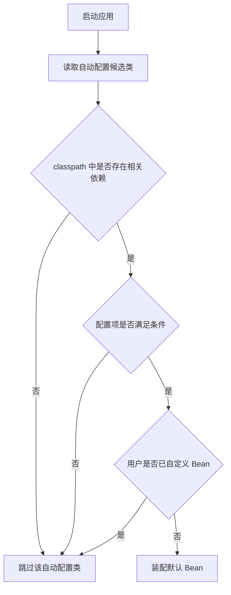

### 2.3 外部化配置

- 支持 `application.yml` / `application.properties`。
- 支持命令行参数、环境变量、JVM 参数等。
- 支持 `@Value`、`@ConfigurationProperties` 注入配置。

```mermaid
flowchart LR
    A[命令行参数] --> E[Environment]
    B[JVM 参数] --> E
    C[系统环境变量] --> E
    D[application.yml / properties] --> E
    E --> F[@Value]
    E --> G[@ConfigurationProperties]
    E --> H[业务 Bean 使用配置]
```

### 2.4 Actuator

- 提供健康检查、指标、环境信息、Bean 信息、日志级别调整等能力。
- 常见端点：`/actuator/health`、`/actuator/metrics`、`/actuator/env`。

---

## 3. 常用核心注解

### 3.1 `@SpringBootApplication`

它是一个组合注解，主要包含：

- `@SpringBootConfiguration`
  - 说明当前类是配置类，本质上等价于 `@Configuration`。
- `@EnableAutoConfiguration`
  - 开启 Spring Boot 自动配置。
- `@ComponentScan`
  - 扫描当前启动类所在包及其子包中的组件。

面试高频点：

- 为什么启动类一般放在根包下？
  - 因为 `@ComponentScan` 默认扫描启动类所在包及子包。

```mermaid
flowchart TD
    A[@SpringBootApplication] --> B[@SpringBootConfiguration]
    A --> C[@EnableAutoConfiguration]
    A --> D[@ComponentScan]
    B --> E[标记配置类]
    C --> F[开启自动配置]
    D --> G[扫描并注册组件]
```

### 3.2 条件注解

自动配置大量依赖条件注解：

- `@ConditionalOnClass`：类路径存在某个类才生效。
- `@ConditionalOnMissingBean`：容器中不存在指定 Bean 才生效。
- `@ConditionalOnBean`：存在指定 Bean 才生效。
- `@ConditionalOnProperty`：配置项满足条件才生效。
- `@ConditionalOnWebApplication`：当前是 Web 应用才生效。

理解重点：

- Spring Boot 自动配置不是“无脑加载”，而是“**按条件加载**”。

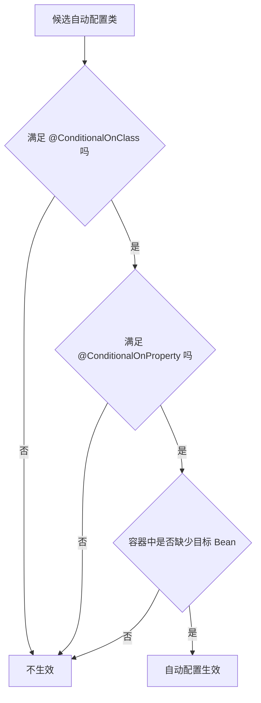

---

## 4. Spring Boot 启动过程

启动入口通常是：

```java
SpringApplication.run(Application.class, args);
```

### 4.1 启动主流程概览

Spring Boot 启动流程可概括为：

1. 创建 `SpringApplication` 对象。
2. 推断应用类型（普通应用 / Servlet Web / Reactive Web）。
3. 加载初始化器 `ApplicationContextInitializer` 和监听器 `ApplicationListener`。
4. 准备环境 `Environment`。
5. 创建容器 `ApplicationContext`。
6. 执行容器刷新 `refresh()`。
7. 触发自动配置、Bean 注册、依赖注入。
8. 如果是 Web 应用，启动内嵌 Web 服务器。
9. 执行 `ApplicationRunner` / `CommandLineRunner`。
10. 发布启动完成事件。

### 4.1.1 启动过程流程图

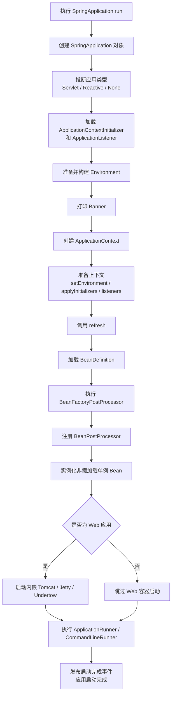

### 4.2 关键源码脉络

#### 第一步：创建 `SpringApplication`

做的事情主要包括：

- 推断主启动类。
- 推断当前 Web 应用类型。
- 从 `spring.factories` / 新版本机制中加载初始化器和监听器。

#### 第二步：运行 `run()`

`run()` 方法中核心工作：

- 启动计时。
- 创建并配置 `Environment`。
- 打印 Banner。
- 创建 `ApplicationContext`。
- 准备容器上下文。
- 刷新容器。
- 执行启动后回调。

### 4.3 `refresh()` 做了什么

`refresh()` 是 Spring 容器启动最核心的方法，主要包括：

1. 准备刷新上下文。
2. 获取并创建 BeanFactory。
3. 对 BeanFactory 进行预处理。
4. 执行 BeanFactoryPostProcessor。
5. 注册 BeanPostProcessor。
6. 初始化国际化、事件广播器等组件。
7. 注册监听器。
8. 实例化所有非懒加载单例 Bean。
9. 完成刷新，发布容器刷新完成事件。

面试时可以总结为：

> Spring Boot 启动本质上还是启动 Spring 容器，核心在于创建 ApplicationContext 并调用 refresh 完成 Bean 工厂后处理、Bean 后处理、单例 Bean 实例化以及 Web 容器启动。

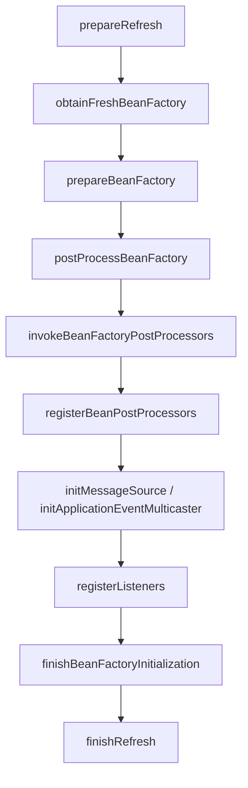

---

## 5. 自动配置原理

### 5.1 核心原理

`@EnableAutoConfiguration` 会导入自动配置类。

底层关键是：

- `AutoConfigurationImportSelector`
- 扫描候选自动配置类
- 按条件注解决定是否装配

### 5.2 为什么导入很多自动配置但不会全生效

因为每个自动配置类上一般都带有各种 `@Conditional` 条件：

- 有依赖才配置
- 有配置项才配置
- 用户没自定义 Bean 才配置

所以最终表现是：

> **Spring Boot 先“加载候选配置类”，再“按条件筛选真正生效的配置类”。**

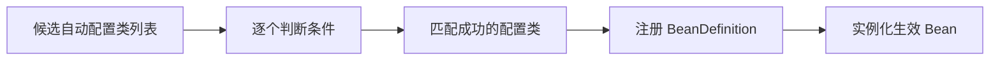

### 5.3 自定义 starter 思路

如果面试问到自定义 starter，可以回答：

1. 创建自动配置类。
2. 使用 `@Configuration` + 条件注解。
3. 将自动配置类注册到对应自动配置导入文件中。
4. 提供 `@ConfigurationProperties` 支持外部化配置。

---

## 6. 配置加载优先级

Spring Boot 支持多种配置来源，常见优先级理解即可：

- 命令行参数
- Java System Properties
- OS 环境变量
- `application.properties` / `application.yml`
- 默认配置

面试回答重点：

- **高优先级配置会覆盖低优先级配置。**
- Spring Boot 这样设计是为了方便不同环境动态覆盖配置。

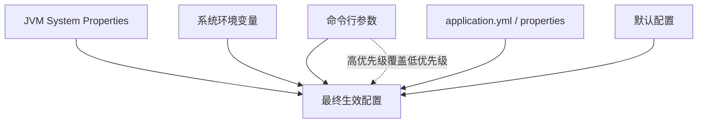

---

## 7. Bean 生命周期

Bean 生命周期常见流程：

1. 实例化 Bean。
2. 属性注入。
3. 调用 `Aware` 接口相关方法。
4. 执行 `BeanPostProcessor#postProcessBeforeInitialization`。
5. 执行初始化方法：
   - `@PostConstruct`
   - `InitializingBean#afterPropertiesSet()`
   - 自定义 `init-method`
6. 执行 `BeanPostProcessor#postProcessAfterInitialization`。
7. Bean 可被使用。
8. 容器关闭时执行销毁方法：
   - `@PreDestroy`
   - `DisposableBean#destroy()`
   - 自定义 `destroy-method`

面试高频点：

- `BeanFactoryPostProcessor` 作用于 **BeanDefinition**。
- `BeanPostProcessor` 作用于 **Bean 实例初始化前后**。

```mermaid
flowchart TD
    A[实例化 Bean] --> B[属性注入]
    B --> C[调用 Aware 接口]
    C --> D[postProcessBeforeInitialization]
    D --> E[@PostConstruct / afterPropertiesSet / init-method]
    E --> F[postProcessAfterInitialization]
    F --> G[Bean 可用]
    G --> H[容器关闭]
    H --> I[@PreDestroy / destroy / destroy-method]
```

---

## 8. Spring Boot 如何解决循环依赖

### 8.1 什么是循环依赖

例如：

- A 依赖 B
- B 又依赖 A

如果是构造器注入：

```java
class A {
    public A(B b) {}
}

class B {
    public B(A a) {}
}
```

这种情况无法提前暴露对象，通常会直接报错。

### 8.2 Spring 解决循环依赖的前提

Spring 解决循环依赖，针对的是：

- **单例 Bean**
- **属性注入/Setter 注入的循环依赖**

不能解决的典型场景：

- 构造器循环依赖
- 多例（prototype）Bean 循环依赖

### 8.3 核心思想：三级缓存

Spring 通过三级缓存解决单例 Bean 的循环依赖。

源码主线主要在下面几个类 / 方法中：

- `AbstractAutowireCapableBeanFactory#doCreateBean`
  - 控制 Bean 创建主流程，决定是否提前暴露对象。
- `DefaultSingletonBeanRegistry#addSingletonFactory`
  - 把“早期引用工厂”放入三级缓存。
- `DefaultSingletonBeanRegistry#getSingleton(String beanName, boolean allowEarlyReference)`
  - 按一级 -> 二级 -> 三级缓存的顺序获取单例。
- `AbstractAutowireCapableBeanFactory#getEarlyBeanReference`
  - 真正决定“提前暴露的是原始对象还是代理对象”。
- `SmartInstantiationAwareBeanPostProcessor#getEarlyBeanReference`
  - 提供早期引用扩展点。
- `AbstractAutoProxyCreator#getEarlyBeanReference`
  - 在 AOP 场景下把早期引用包装成代理对象。

#### 一级缓存

- `singletonObjects`
- 存放已经完全初始化好的单例 Bean。

#### 二级缓存

- `earlySingletonObjects`
- 存放已经创建出来的“早期引用”。
- 注意：这里存的不是对象工厂，而是实际对象本身。
- 这个对象有两种可能：
  - 原始对象
  - AOP 提前代理后的对象

#### 三级缓存

- `singletonFactories`
- 存放能够创建“提前暴露 Bean”的对象工厂。
- 本质不是多加一层普通缓存，而是为了**延迟决定**早期引用到底返回什么。
- 工厂通常长这样：

```java
() -> getEarlyBeanReference(beanName, mbd, bean)
```

- 也就是说，三级缓存里存的是“生成策略”，不是最终对象。

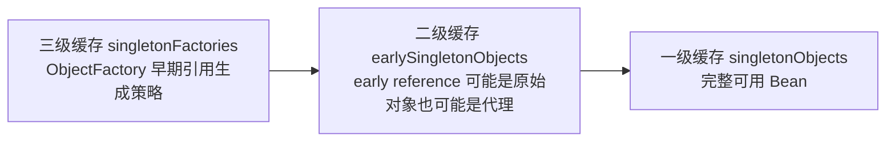

### 8.4 解决流程

#### 8.4.1 提前暴露发生在什么时候

在 `AbstractAutowireCapableBeanFactory#doCreateBean` 中，Bean 先实例化，再决定是否提前暴露：

```java
boolean earlySingletonExposure =
    (mbd.isSingleton() && this.allowCircularReferences && isSingletonCurrentlyInCreation(beanName));
```

只有下面条件同时满足，Spring 才会把对象工厂放入三级缓存：

- 当前 Bean 是 `singleton`
- 允许循环依赖：`allowCircularReferences = true`
- 当前 Bean 已经处于“正在创建中”状态

随后执行：

```java
addSingletonFactory(beanName, () -> getEarlyBeanReference(beanName, mbd, bean));
```

注意这个时点非常关键：

- 此时 Bean **已经实例化**，但**还没完成属性填充和初始化**
- Spring 并不会立刻把对象放进二级缓存
- 只是先把“如果有人需要早期引用，该怎么拿”的工厂放入三级缓存

#### 8.4.2 A 依赖 B，B 依赖 A 的完整流程

以 A 依赖 B，B 依赖 A 为例：

1. 创建 A，实例化后，A 还未完成属性填充和初始化。
2. 为了后续可能解决循环依赖，Spring 将 A 的对象工厂放入三级缓存。
3. A 需要注入 B，于是开始创建 B。
4. 创建 B 时，发现 B 依赖 A。
5. 此时 Spring 去一级缓存找 A，没有。
6. 去二级缓存找 A，没有。
7. 去三级缓存找到 A 的对象工厂，获取 A 的“早期对象”，放入二级缓存。
8. B 拿到 A 的早期对象，完成注入，B 创建完成。
9. 回到 A，A 注入 B，继续初始化，最终 A 创建完成。
10. 初始化完成的 Bean 放入一级缓存。

这里缓存迁移链路可以总结为：

- 刚实例化后：只有三级缓存里有 `ObjectFactory`
- 第一次真的发生循环依赖获取时：`singletonFactories -> earlySingletonObjects`
- 完整初始化结束后：`earlySingletonObjects -> singletonObjects`

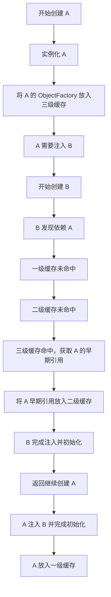

#### 8.4.3 `getSingleton` 到底是怎么查缓存的

`DefaultSingletonBeanRegistry#getSingleton(String beanName, boolean allowEarlyReference)` 的逻辑可以概括为：

1. 先查一级缓存 `singletonObjects`
2. 如果没命中，并且当前 Bean 正在创建中，再查二级缓存 `earlySingletonObjects`
3. 如果二级也没命中，且 `allowEarlyReference = true`，再查三级缓存 `singletonFactories`
4. 命中三级缓存后：
   - 调用 `ObjectFactory#getObject()` 创建早期引用
   - 把这个早期引用放入二级缓存
   - 从三级缓存删除对应工厂

所以要注意两点：

- 二级缓存的作用是：**早期引用只创建一次，后面重复使用**
- 三级缓存的作用是：**只有真正需要时，才创建早期引用**

#### 8.4.4 什么时候拿到的是对象本身，什么时候拿到的是 AOP 对象

这个问题的关键，不在 `getSingleton` 本身，而在三级缓存里的工厂：

```java
() -> getEarlyBeanReference(beanName, mbd, bean)
```

也就是说：

- `getSingleton` 只是负责查缓存和触发工厂
- 真正决定返回原始对象还是代理对象的是 `getEarlyBeanReference`

默认情况下：

- `SmartInstantiationAwareBeanPostProcessor#getEarlyBeanReference` 默认直接返回原始 `bean`
- 所以**没有 AOP/特殊后处理器参与时，拿到的是对象本身**

如果当前 Bean 会被 AOP 自动代理，例如经过 `AbstractAutoProxyCreator`：

- `AbstractAutoProxyCreator#getEarlyBeanReference` 会调用 `wrapIfNecessary(...)`
- 如果该 Bean 命中切面、事务、权限等代理条件，就会提前返回代理对象

因此可以这样记：

- **拿到对象本身**：发生循环依赖，但该 Bean 不需要代理，或者没有相关后处理器改写早期引用
- **拿到 AOP 对象**：发生循环依赖，且该 Bean 命中 AOP 代理条件，`getEarlyBeanReference` 返回的是代理

可以用下面这张流程图理解：

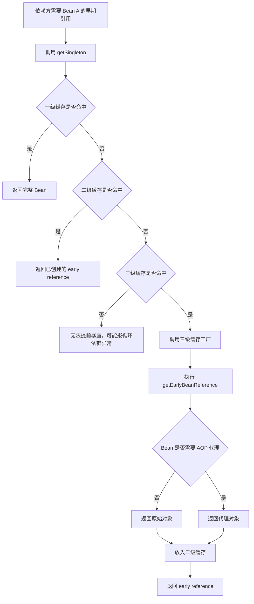

#### 8.4.5 初始化完成后，最终放进一级缓存的是谁

`doCreateBean` 在初始化后还会做一次关键处理：

- 如果初始化后的 `exposedObject` 还是原始对象本身
  - 那么 Spring 会直接使用之前的 `earlySingletonReference` 作为最终暴露对象
  - 这样可以保证“注入出去的对象”和“最终容器里的对象”保持一致
- 如果初始化后对象又被额外包装了一层，而之前别的 Bean 注入的是原始对象
  - 就会出现依赖方拿到 raw bean、容器最终持有 proxy 的不一致问题

此时就会涉及 `allowRawInjectionDespiteWrapping`：

- 默认不建议放开
- 它的存在是为了兼容某些极端场景
- 面试里可以理解为：Spring 默认更希望“依赖方拿到的”和“最终放进容器的”是同一个语义对象

#### 8.4.6 为什么 AOP 不会被重复代理

在 `AbstractAutoProxyCreator` 中：

- 早期引用阶段，`getEarlyBeanReference` 会记录当前 Bean 已经走过“提前代理”
- 初始化完成后的 `postProcessAfterInitialization` 阶段，会根据这个标记避免再次代理

这样能保证：

- 循环依赖中注入出去的是代理对象
- 最终放进一级缓存的仍然是同一个代理语义对象
- 不会出现“提前代理一次，初始化后再代理一次”的重复包装

### 8.5 为什么需要三级缓存，二级不够吗

面试高频题。

核心回答：

- 如果没有三级缓存，就无法很好处理 AOP 代理场景。
- 三级缓存里存的是 `ObjectFactory`，可以在真正需要提前引用时，决定返回原始对象还是代理对象。
- 如果只有二级缓存，提前暴露的对象就必须过早确定，不利于代理增强。

更准确地说：

- 二级缓存存的是“早期引用结果”
- 三级缓存存的是“早期引用生成策略”

如果只有二级缓存，会有两个问题：

1. 在 Bean 刚实例化完时，就必须决定暴露原始对象还是代理对象。
2. 一旦后面发现它需要 AOP 代理，就容易出现依赖方拿到 raw bean，而容器最终保存的是 proxy 的不一致问题。

一句话总结：

> 三级缓存的价值在于：**延迟决定提前暴露的是原始对象还是代理对象。**

再进一步一句话总结：

> 二级缓存解决“复用同一个 early reference”，三级缓存解决“延迟创建这个 early reference”。

### 8.6 Spring Boot 2.6 之后的变化

- Spring Boot 2.6 默认禁止循环依赖。
- 配置项：

```yaml
spring:
  main:
    allow-circular-references: true
```

面试回答建议：

- 虽然框架提供能力，但不建议依赖循环依赖。
- 出现循环依赖通常意味着设计职责耦合过重，应该优先重构。

### 8.7 如何从设计上避免循环依赖

- 拆分职责，避免双向强依赖。
- 引入中间层/门面层。
- 使用事件发布订阅解耦。
- 使用 `@Lazy` 延迟注入作为权宜之计。
- 优先通过接口隔离、领域拆分来解决。

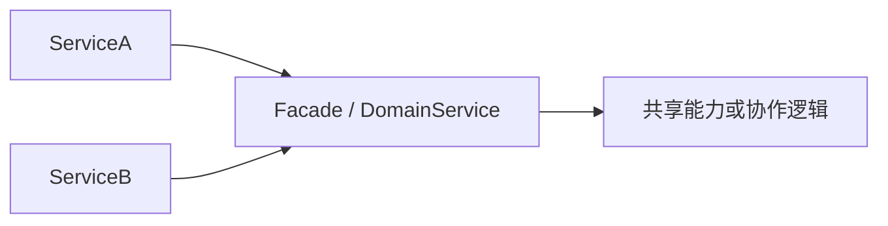

---

## 9. Spring Boot 4 / Spring Framework 7 升级差异与升级思路

这一部分更偏实际项目升级与面试延展题。

### 9.1 先说结论：Boot 4 = Spring 7 这一代的整体升级

如果从大版本关系上理解：

- **Spring Boot 4** 底层绑定的是 **Spring Framework 7**
- 它不是一次“只改几个 starter 版本号”的小升级，而是一代技术基线的整体抬升

面试里可以这样概括：

> Spring Boot 4 对应 Spring Framework 7，这一代升级的重点不只是功能增强，更重要的是运行时基线、Jakarta EE 规范版本、Servlet 容器、JSON 库、测试体系以及 AOT / Native 生态的整体演进。

### 9.2 主要升级差异

#### 9.2.1 Java 与生态基线

- Spring Boot 4 要求 **Java 17+**。
- Spring Framework 7 同样保持 **JDK 17 baseline**，但官方更鼓励使用更新的 LTS JDK。
- Kotlin 生态也进一步提升到更新版本（如 Kotlin 2.2）。

这意味着：

- 如果你的项目还停留在 Java 8 / 11，不能直接升到 Boot 4。
- 企业项目通常需要先完成 **JDK 升级**，再谈框架升级。

#### 9.2.2 Jakarta EE 11 / Servlet 6.1 基线

- Spring Boot 4 / Spring 7 这一代整体转向更高版本的 **Jakarta EE 11**。
- Servlet 基线提升到 **Servlet 6.1**。

这会带来几个直接影响：

- Web 容器要跟着升级，例如 Tomcat 11、Jetty 12.1 这一代。
- 依赖 Jakarta API 的组件也要同步升级。
- 老旧第三方库如果还停留在较老的 Servlet/Jakarta 规范上，可能直接不兼容。

#### 9.2.3 Undertow 内嵌支持被移除

这是 Boot 4 比较容易考到的升级点。

- Spring Boot 4 需要 Servlet 6.1 基线。
- 官方迁移说明里明确提到：**Undertow 暂不兼容这个基线**。
- 因此 Boot 4 去掉了 Undertow starter 以及作为内嵌容器的支持。

实际含义是：

- 如果项目之前使用 `spring-boot-starter-undertow`
- 升级到 Boot 4 时通常要切回 **Tomcat** 或 **Jetty**

#### 9.2.4 Spring Boot 模块与 starter 更细化

- Boot 4 的模块设计更聚焦，不再像以前那样由少数大 jar 覆盖很多能力。
- 一些过去“因为三方依赖在 classpath 里就能顺便工作”的功能，升级后可能需要额外显式引入 starter。

面试里可以理解为：

- 以前更偏“宽松聚合”
- Boot 4 更偏“模块清晰、职责更明确”

所以升级时要特别注意：

- 依赖有没有被拆分
- 以前隐式生效的能力，现在是否需要显式 starter

#### 9.2.5 Jackson 3 成为主路径

- Spring Boot 4 把 **Jackson 3** 作为首选 JSON 实现。
- 同时提供一个过渡性的 `spring-boot-jackson2` 模块，但它是 **deprecated** 的过渡方案，不适合作为长期依赖。

这意味着：

- 如果项目里有自定义 `ObjectMapper` 配置
- 或依赖一些只兼容 Jackson 2 的三方组件
- 升级时很可能需要额外排查 JSON 序列化/反序列化行为差异

#### 9.2.6 Nullability、类型签名和 Kotlin 影响更明显

- Boot 4 增加了更明确的空值注解支持（如 JSpecify nullability）。
- 对 Kotlin 项目或启用了空安全检查的 Java 项目，可能带来新的编译错误或告警。

也就是说：

- 升级后不一定是“运行时报错”
- 很多问题会提前体现在 **编译期类型检查** 上

#### 9.2.7 Spring Framework 7 的 API / 测试体系变化

Spring Framework 7 的变化点里，面试比较值得提的是：

- `HttpHeaders` API 做了调整，不再继续以过去那种 `MultiValueMap` 方式完全暴露语义
- 某些依赖旧行为的代码需要调整
- Spring TestContext / `SpringExtension` 行为有变化，特别是 `@Nested` 测试、扩展上下文范围等场景
- 测试相关自定义扩展或 `TestExecutionListener` 可能受影响

所以升级不只是业务代码改一改，测试代码和测试基础设施也要一起验证。

#### 9.2.8 AOT / Native / GraalVM 生态继续前进

- Spring 7 对 AOT、Native Image、GraalVM 的支持继续增强。
- 相关基线和 reachability metadata 也在升级。

这类变化对普通 CRUD 项目感知可能不强，但对以下场景影响较大：

- 需要原生镜像构建
- 启动速度和资源占用优化要求高
- 使用大量反射、动态代理、运行时扫描的复杂项目

### 9.3 升级时最容易踩坑的地方

项目从旧版本升到 Boot 4 / Spring 7，通常不是框架本身难，而是“周边生态一起升级”带来的连锁问题。

常见风险包括：

- **JDK 版本不达标**
- **Servlet 容器版本不兼容**
- **旧三方依赖还停留在旧 Jakarta / Servlet / Jackson 体系**
- **配置项重命名或默认行为变化**
- **测试框架、自定义扩展、集成测试基建失效**
- **序列化、HTTP header、校验、ORM 等基础能力行为变化**

一句话总结：

> 升级最大的难点，往往不是 Spring Boot 本身，而是项目依赖树、运行环境和测试体系是否跟得上新基线。

### 9.4 推荐升级思路

#### 9.4.1 不要跨代硬升，先补齐中间版本

官方升级建议可以概括为：

- 如果你还在 Boot 2.x，先升到 Boot 3.x 稳定版本
- 如果你在 Boot 3.x 的较早版本，先升到 **Boot 3.5** 这一代再看 Boot 4
- 再从 Boot 3.5 升到 Boot 4

原因很简单：

- 大版本升级越多，变量越多
- 分阶段升级更容易定位问题

#### 9.4.2 升级顺序建议

实战中比较稳妥的顺序通常是：

1. **先升级 JDK**
2. **再升级构建工具和插件**（Maven / Gradle / CI）
3. **再升级 Spring Boot / Spring Framework 主版本**
4. **再升级容器和关键三方依赖**
5. **最后统一回归测试、压测、灰度发布**

这个顺序的价值在于：

- 先解决运行时基线问题
- 再解决框架兼容问题
- 最后解决业务行为差异问题

#### 9.4.3 升级前先做依赖盘点

升级前最好先梳理下面这些内容：

- 当前 JDK 版本
- 当前 Boot / Spring 版本
- Web 容器类型（Tomcat / Jetty / Undertow）
- JSON 方案（Jackson 2 还是其他）
- ORM / 校验 / 安全 / MQ / RPC 等核心依赖版本
- 是否使用 AOT / Native / Kotlin / 自定义 starter / 自定义自动配置

因为真正的升级风险，往往就藏在这些外围组件里。

#### 9.4.4 先处理“硬阻塞”问题

所谓硬阻塞，指的是“不改就根本启动不起来”的问题，例如：

- JDK 不够
- Undertow 不兼容
- Jakarta / Servlet 相关类冲突
- 关键 starter 或三方依赖缺失
- 编译器直接报类型错误

升级时应优先清理这些问题，再去处理细节行为差异。

#### 9.4.5 再处理“软差异”问题

软差异通常是：

- 应用能启动，但行为变了
- JSON 序列化结果不同
- Header 处理方式变化
- 测试偶发失败
- 配置项默认值变化
- 健康检查、监控指标、日志格式有变化

这类问题需要靠：

- 单元测试
- 集成测试
- 接口回归测试
- 线上灰度验证

逐步确认。

### 9.5 面试回答模板

可以这样回答：

> Spring Boot 4 对应的是 Spring Framework 7，这一代升级的核心不是只升几个依赖版本，而是整个技术基线的抬升。比如 Java 17、Jakarta EE 11、Servlet 6.1、Tomcat 11/Jetty 12.1 这一代都会成为升级链路的一部分。Boot 4 还移除了 Undertow 的内嵌支持，并把 Jackson 3 作为主路径，所以项目升级时除了改框架版本，还要重点检查 Web 容器、JSON 方案、测试体系和三方依赖兼容性。实际升级思路一般是先升 JDK，再升构建工具，再从 Boot 3.5 过渡到 Boot 4，最后通过回归测试和灰度发布验证行为差异。

### 9.6 一页速记版

#### Boot 4 / Spring 7 升级关键词

- Java 17+
- Spring Framework 7
- Jakarta EE 11
- Servlet 6.1
- Tomcat 11 / Jetty 12.1
- Undertow 移除
- Jackson 3
- Starter 更细化
- JSpecify / Nullability
- 测试体系变化
- AOT / Native 持续增强

#### 升级路径关键词

- Boot 2.x -> 3.x -> 3.5 -> 4.0
- 先升 JDK
- 再升构建工具
- 再升框架主版本
- 再处理三方依赖
- 最后做回归和灰度

---

## 10. Spring Boot 常见面试题

### 10.1 Spring Boot 和 Spring 有什么区别

- Spring 是基础生态与 IOC/AOP 核心框架。
- Spring Boot 是基于 Spring 的快速开发脚手架。
- Boot 重点在自动配置、约定优于配置、快速集成。

### 10.2 `@Autowired` 和 `@Resource` 区别

- `@Autowired` 默认按类型注入，来自 Spring。
- `@Resource` 默认按名称注入，来自 JSR 规范。
- 都可以完成依赖注入，但 Spring 项目里更常用 `@Autowired` / `@Qualifier`。

### 10.3 `@ConfigurationProperties` 和 `@Value` 区别

- `@Value` 适合读取单个配置。
- `@ConfigurationProperties` 适合批量、结构化配置绑定。
- 后者更适合复杂业务配置和统一管理。

```mermaid
flowchart LR
    A[配置源] --> B{@Value 还是 @ConfigurationProperties}
    B -- 单个值 --> C[@Value]
    B -- 批量结构化 --> D[@ConfigurationProperties]
```

### 10.4 `@Component`、`@Service`、`@Controller` 有什么区别

- 本质上都是组件注册注解。
- 语义不同：
  - `@Component`：通用组件
  - `@Service`：业务层
  - `@Controller`：控制层
  - `@Repository`：持久层，同时对数据访问异常有转换语义

### 10.5 什么是 IOC 和 AOP

- IOC：控制反转，对象的创建与依赖关系交给容器管理。
- AOP：面向切面编程，将日志、事务、权限等横切逻辑与业务逻辑分离。

### 10.6 Spring Boot 事务失效场景

常见失效原因：

- 方法不是 `public`
- 同类内部调用，绕过代理
- 异常被吃掉，没有抛出
- 数据库引擎不支持事务
- 配置的传播行为不符合预期

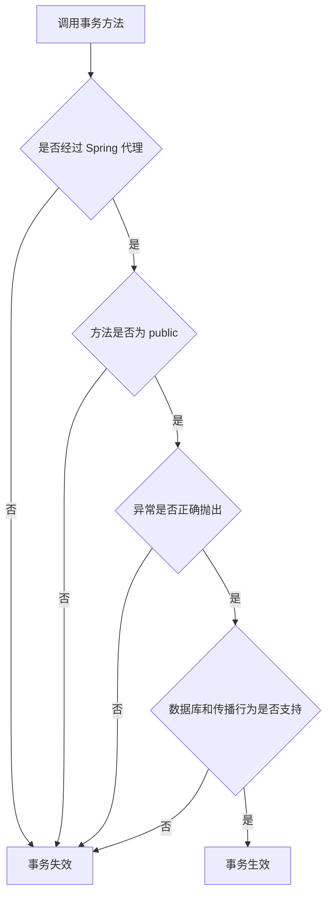

### 10.7 Spring Boot 中常见读取配置方式

- `@Value`
- `Environment`
- `@ConfigurationProperties`

### 10.8 Bean 的单例是线程安全吗

- **单例只代表容器中只有一个对象，不代表线程安全。**
- 如果 Bean 中有可变共享状态，就需要考虑并发安全。

---

## 11. 启动过程面试回答模板

可以这样回答：

> Spring Boot 启动入口是 `SpringApplication.run()`。启动时会先创建 `SpringApplication` 对象，推断应用类型并加载初始化器和监听器，然后准备 `Environment` 和 `ApplicationContext`。接着调用 Spring 容器的 `refresh()` 方法，在这个过程中完成 BeanDefinition 加载、BeanFactory 后处理器执行、BeanPostProcessor 注册、单例 Bean 实例化。如果是 Web 项目，还会在刷新过程中启动内嵌 Tomcat。最后执行 `ApplicationRunner` 和 `CommandLineRunner`，整个应用完成启动。

---

## 12. 循环依赖面试回答模板

可以这样回答：

> Spring 解决循环依赖主要依赖三级缓存，前提是单例 Bean 且通常是 Setter/属性注入场景。一级缓存存完整 Bean，二级缓存存提前暴露的 Bean，三级缓存存对象工厂。创建 Bean A 时，如果发现依赖 Bean B，而 B 又依赖 A，Spring 会从三级缓存中拿到 A 的早期引用，先完成 B 的注入，再回过头完成 A 的初始化。构造器循环依赖和 prototype Bean 循环依赖一般无法解决。Spring Boot 2.6 之后默认关闭循环依赖，因为这种情况通常意味着设计耦合过高。

---

## 13. 面试加分点

如果想回答得更有层次，可以补这几句：

- Spring Boot 的核心不是“自动”，而是“**条件化自动配置**”。
- 启动过程核心不是 `run()` 本身，而是底层 `ApplicationContext#refresh()`。
- 循环依赖不是值得炫耀的特性，而是 Spring 为兼容复杂依赖图提供的兜底机制。
- 真正优秀的工程实践是尽量通过合理设计避免循环依赖。

---

## 14. 一页速记版

### Spring Boot 核心关键词

- Starter
- 自动配置
- 外部化配置
- 内嵌服务器
- Actuator
- 约定优于配置

### 启动过程关键词

- `SpringApplication.run()`
- 创建 `SpringApplication`
- 准备 `Environment`
- 创建 `ApplicationContext`
- 执行 `refresh()`
- 实例化单例 Bean
- 启动 Tomcat
- 执行 Runner

### 循环依赖关键词

- 单例
- Setter/属性注入
- 三级缓存
- 提前暴露对象
- AOP 代理
- 构造器循环依赖无法解决
- Boot 2.6 默认禁用
